# Configuration File

Skim's configuration lives in a single YAML file. YAML was chosen over JSON
because it tolerates comments, optional quoting, and trailing-comma slips —
small ergonomic wins that matter when a non-developer is hand-editing the
file from a tutorial.

The file is hierarchical and **every field is optional**. Skim fills in
sensible defaults for anything you leave out, so a working configuration can
be as short as a single `keyboard.layers` list. The full schema is large only
because it lets you fine-tune nearly every visual element.

You point Skim at a config with the `--config <path>` flag (see
[Command Line Options](cli-options.md)). If you'd rather generate or edit the
file interactively, see the [Configurator UI](configurator-ui.md).

## Top-level structure

The file has three top-level sections:

| Section     | What it controls                                        |
| ----------- | ------------------------------------------------------- |
| `keyboard`  | Physical hardware features and per-layer metadata.      |
| `keycodes`  | How QMK keycodes are transformed and labelled on keys.  |
| `output`    | Image dimensions, colors, borders, legends, and styling. |

A minimal file looks like:

```yaml
keyboard:
  layers:
    - index: 0
      name: "Base"
    - index: 1
      name: "Symbols"
```

A complete reference file with every section populated lives at
[`samples/config/skim-config.yaml`](https://github.com/Townk/skim/blob/mainline/samples/config/skim-config.yaml)
in the repository.

---

## `keyboard`

Describes the hardware variant you're rendering and gives each layer in the
keymap a human-readable identity.

Current schema:

```yaml
keyboard:
  features:
    ...                      # see keyboard.features below
  layers:
    ...                      # see keyboard.layers below
```

### `features` { #keyboard-features }
A bag of hardware-feature toggles. Today there's only one knob, but the
sub-section exists to keep room for future hardware variants without
breaking the schema.

Current schema:

```yaml
keyboard:
  features:
    double_south: <boolean>
```

#### `double_south`

| Type      | Default |
| --------- | ------- |
| `boolean` | `false` |

Whether the finger clusters render the double-south (DS) key positions. Set
to `true` only if your physical keyboard has these extra southern switches.

On a stock Svalboard build, leave it `false` — those positions will be
hidden in the output.

<div class="option-comparison" markdown="1">

<figure markdown="1">
<figcaption><code>double_south: false</code></figcaption>
{ width="180" loading=lazy }
</figure>

<figure markdown="1">
<figcaption><code>double_south: true</code></figcaption>
{ width="180" loading=lazy }
</figure>

</div>

### `layers` { #keyboard-layers }
A list of layer descriptors. The list does two unrelated jobs at once, and
it helps to keep them separate when reading the rest of this section:

- **Order of the list** controls how layers stack in the **overview image**.
  The first entry renders on the *bottom* row and the last on the top, so
  reading the list top-to-bottom corresponds to reading the overview
  bottom-to-top. This is intentional: layer 0 is conventionally the base
  layer, and stacking it at the bottom matches how most users think about
  layer "depth."
- **`index` field** on each entry is the layer's **QMK firmware index** —
  the slot the layer occupies in the compiled binary, and the integer that
  keycodes like `MO(...)`, `LT(...)`, and `TG(...)` target.

List position and firmware index are independent. You can list a layer first
and give it `index: 14` if your firmware skips middle slots — useful for Vial
and Keybard keymaps that can populate non-sequential layers like `0, 1, 2, 14,
15`.

Current schema:

```yaml
keyboard:
  layers:
    - index: <integer>
      id: <string>
      name: <string>
      variant: <string>
    - ...
```

Each entry has these fields:

#### `index`

| Type      | Default | Range    |
| --------- | ------- | -------- |
| `integer` | —       | `0`–`31` |

The QMK firmware layer index — what the binary firmware ends up with after `qmk
compile`, and what `LT(...)` / `MO(...)` / `TG(...)` keycodes target. If this
doesn't match what's actually programmed into your firmware, layer-switching
keys will point at the wrong layer in the rendered image.

The range matches QMK's stock `MAX_LAYERS` of 32. The Configurator UI enforces
`0`–`31`; the YAML schema itself doesn't bound the value, so hand-edited config
files can technically set higher indices, but the renderer and the default
color generator are calibrated for `0`–`31`.

This value is used in the "Overview" keymap and on the "Layer Indicators" to
represent the layers defined in your keymap.

<div class="option-comparison" markdown="1">

<figure markdown="1">
<figcaption>Indicator on a finger-cluster centre key</figcaption>
{ height="160" loading=lazy }
</figure>

<figure markdown="1">
<figcaption>Indicator on a thumb-cluster down key</figcaption>
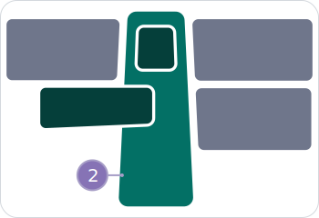{ height="160" loading=lazy }
</figure>

</div>

#### `name`

| Type     | Default |
| -------- | ------- |
| `string` | —       |

The full descriptive name shown as the title of the per-layer image and as
the layer's row label in the overview. Long names are fine — the overview
sizes them automatically.

<div class="option-comparison" markdown="1">

<figure markdown="1">
<figcaption>Auto-named layer badge</figcaption>
{ width="200" loading=lazy }
</figure>

<figure markdown="1">
<figcaption>Custom-named layer badge</figcaption>
{ width="280" loading=lazy }
</figure>

</div>

When no name is provided, Skim simply uses the word _LAYER_ followed by the QMK firmware layer index.

#### `id`

| Type     | Default |
| -------- | ------- |
| `string` \| `null` | `null` |

An optional alphanumeric handle for this layer, used when your keymap
references layers by C `#define` macros (the form `qmk c2json` produces). If
your `LT(...)` / `MO(...)` arguments use literal integers, you don't need this.
If they use `#define`d names like `_BASE` or `_NAV`, set `id: "_BASE"` so Skim
can resolve them back to the firmware index.

> [!NOTE]
> This option has no visual impact in the final image, but is required to produce
> an image with the correct connections between layers.

#### `variant`

| Type     | Default |
| -------- | ------- |
| `string` \| `null` | `null` |

A short secondary label rendered below the layer name in the overview
image — typically used to tag the keymap variant (`"QWERTY"`, `"COLEMAK"`,
`"DVORAK"`). Leave `null` to not display any text below the layer name.

<div class="option-comparison" markdown="1">

<figure markdown="1">
<figcaption>Layer badge with a variant label</figcaption>
{ width="240" loading=lazy }
</figure>

</div>

---

## `keycodes`

Customizes how Skim turns raw QMK keycode strings into the labels that
appear on rendered keys, plus metadata for macros, tap-dances, and the
legends Skim emits.

Current schema:

```yaml
keycodes:
  pre_process:
    - keycode: <string>
      target: <string>
    - ...

  overrides:
    - keycode: <string>
      target: <string>
    - ...

  macros:
    - id: <string>
      name: <string>
      preview: <string>
    - ...

  tap_dances:
    - id: <string>
      name: <string>
      preview: <string>
    - ...

  symbol_legend_aliases:
    <KEY_CODE>: <TARGET_KEY_CODE>,
    ...

  symbol_descriptions:
    <CATEGORY>:
      <KEY_CODE>: <DESCRIPTION>,
      ...
    ...

  function_descriptions:
    <CATEGORY>:
      <FUNCTION_NAME>: <DESCRIPTION>,
      ...,
    ...
```

The pipeline that produces a key's label runs in this order:

1. **`pre_process`** rewrites the *input* keycode string before any resolution
   happens. Think of this step as a plain search-and-replace pass that runs
   before Skim looks anything up.
2. Skim's **bundled keycode-to-label table** turns the (possibly rewritten)
   keycode into a label. The bundled table is internal to Skim, but its
   entries follow the exact same shape as `overrides` below — what you can
   write in `overrides` is the same kind of thing Skim writes in the bundled
   table.
3. **`overrides`** has the final word: it can replace the resolved label with
   anything you like, and entries here win against the bundled table.

### `pre_process` { #keycodes-pre-process }
| Type | Default |
| ---- | ------- |
| list of `{keycode, target}` | `[]` |

Use this to **normalise non-standard keycodes** so the standard resolver
recognises them. A common case: a custom keycode in your firmware that
behaves like a stock QMK construct. For instance:

```yaml
keycodes:
  pre_process:
    - keycode: "MY_CUSTOM_KEY"
      target: "MT(MOD_LCTL,KC_A)"
```

After this rule, every appearance of `MY_CUSTOM_KEY` in the keymap is
treated as `MT(MOD_LCTL,KC_A)`, which the bundled resolver knows how to
render.

> [!NOTE]
> `pre_process` rules are **textual substitutions** that happen before label
> resolution, so they should not rely on alias-resolution features in keycode
> strings. Use plain canonical QMK syntax in the `target`.

### `overrides` { #keycodes-overrides }
| Type | Default |
| ---- | ------- |
| list of `{keycode, target}` | `[]` |

Force the rendered label for a specific keycode, regardless of what the default
mapping produces. Common uses: spelling words out (`KC_SPC` → `"Space"`),
choosing a glyph (`KC_ENT` → `"⏎"`). For instance:

```yaml
keycodes:
  overrides:
    - keycode: "KC_SPC"
      target: "Space"
    - keycode: "KC_LCTL"
      target: "^"
```

The `target` field is always processed by the [Key Label Resolution
algorithm](#key-label-resolution-algorithm), which allows you to create a rich
graphic set of key code symbols without repeating yourself.

### `macros` { #keycodes-macros }
| Type | Default |
| ---- | ------- |
| list of `{id, name, preview}` | `[]` |

Metadata for QMK macros. Each entry binds a macro identifier to a friendly
name that Skim uses in the macros legend table on generated images.

<div class="option-comparison" markdown="1">
  <figure markdown="1">
  <figcaption>Named macro with all action kinds</figcaption>
  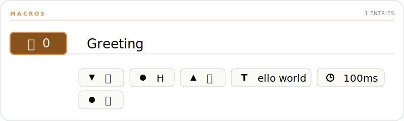{ width="600" loading=lazy }
  </figure>
</div>

#### `id`

| Type     | Default |
| -------- | ------- |
| `string` | —       |

The string used to reference this macro in your keymap. For Vial and Keybard
keymaps that's one of the standard slot names (`M0`, `M1`, …, `M49`); for
QMK `keymap.c` keymaps it's the name you used in your `#define` (e.g.
`MY_MACRO` for `MACRO_MY_MACRO`).

#### `name`

| Type             | Default |
| ---------------- | ------- |
| `string` \| `null` | `null`  |

A short human-readable label shown in the macros legend. This field is
Skim-only — it has no equivalent in Vial or Keybard, so changes here
don't round-trip back to your keyboard's firmware.

#### `preview`

| Type             | Default |
| ---------------- | ------- |
| `string` \| `null` | `null`  |

A read-only single-line text representation of the macro, displayed below
the macro's name in the legend. Although saved in the configuration file,
this field is **not** intended for hand-editing. To regenerate it, run the
Configurator UI with the `-k` / `--keymap` option pointed at your keymap
file — Skim will read the macro definition from the keymap and refresh the
preview.

### `tap_dances` { #keycodes-tap-dances }
| Type | Default |
| ---- | ------- |
| list of `{id, name, preview}` | `[]` |

Like `macros`, the `tap_dances` field carries metadata for QMK tap-dance
keys. Each entry binds a tap-dance identifier to a friendly name that Skim
uses in the tap-dance legend table on generated images.

<div class="option-comparison" markdown="1">
  <figure markdown="1">
  <figcaption>Named tap-dance row</figcaption>
  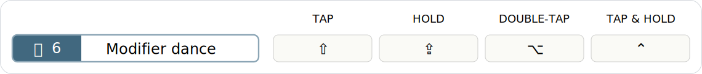{ width="600" loading=lazy }
  </figure>
</div>

#### `id`

| Type     | Default |
| -------- | ------- |
| `string` | —       |

Must match the tap-dance index supplied to QMK's `TD(...)` macro: one of
`TD(0)`, `TD(1)`, `TD(2)`, …, `TD(49)`.

Skim's internal `pre_process` table also rewrites these calls to plain
identifiers (`TD(0)` → `TD0`, `TD(1)` → `TD1`, …, `TD(49)` → `TD49`) — that
mapping isn't a QMK standard, but it lets Skim render specific `keymap.c`
styles that reference the tap-dance by an unwrapped name.

#### `name`

| Type             | Default |
| ---------------- | ------- |
| `string` \| `null` | `null`  |

A short human-readable label shown in the tap-dance legend. Like
`macros.name`, this field is Skim-only — it has no equivalent in Vial or
Keybard, and changes don't round-trip back to your firmware.

#### `preview`

| Type             | Default |
| ---------------- | ------- |
| `string` \| `null` | `null`  |

A read-only single-line text representation of the tap-dance, displayed
below its name in the legend. Although saved in the configuration file,
this field is **not** intended for hand-editing. To regenerate it, run the
Configurator UI with the `-k` / `--keymap` option pointed at your keymap
file — Skim will read the tap-dance definition and refresh the preview.

### `symbol_descriptions` { #keycodes-symbol-descriptions }
| Type | Default |
| ---- | ------- |
| `{category: {keycode: description}}` | `{}` |

Per-keycode description overrides for the symbol legend. The legend ships
with a curated default table; entries here either override an existing
keycode within a bundled category or add brand-new categories.

```yaml
keycodes:
  symbol_descriptions:
    Modifiers:
      KC_LEFT_CTRL: "Control (my custom label)"
    "My Section":
      MY_KEY: "Does the thing"
```

User keys in an existing bundled category take precedence over the bundled
description for the same keycode. Brand-new categories are appended after
the bundled ones in the legend.

### `function_descriptions` { #keycodes-function-descriptions }
| Type | Default |
| ---- | ------- |
| `{category: {keycode: description}}` | `{}` |

Per-function description overrides for the function-keycode legend — the
table that explains constructs like `MO`, `LT`, `OSL`, `OSM`, `TG`, and
`TT`. Same shape and merge rules as `symbol_descriptions`: user keys
override bundled entries within a category, and new categories are
appended after the bundled ones.

```yaml
keycodes:
  function_descriptions:
    Layers:
      MO: "Hold to layer #0;"
```

#### Placeholders

Description strings support a small substitution syntax that lets the text
reference the function's arguments and pull in other keycode glyphs:

| Token        | Meaning |
| ------------ | ------- |
| `#N;`        | The Nth argument, rendered as a literal `#` character. Use when you want to say "an arg goes here" without showing its actual value. |
| `@N;`        | The Nth argument, **recursively resolved** to its rendered label. Triggers per-instance mode (see below). |
| `@@KEYCODE;` | An alias reference — replaced by the resolved label of `KEYCODE`. Lets a description embed a glyph that's already named in the bundled keycode table. |
| `\|;`         | The tap/hold separator character (the box-drawing `│`). Rare in descriptions; appears mostly in keycode aliases. |

#### Generic vs per-instance entries

Whether a description produces **one** legend row per function or **one
per unique call** depends entirely on whether it contains an `@N;`
placeholder. Skim flips automatically based on the description text.

- **Generic** (no `@N;`): one row in the legend per function name,
  shared across every call site in the keymap. Both `#N;` and any `@N;`
  that *would* have appeared collapse to a literal `#`.

    ```yaml
    Layers:
      MO: "Hold to layer #0;"
    ```

    Whether your keymap uses `MO(0)`, `MO(1)`, or `MO(14)`, the legend
    shows a single `MO` row reading **"Hold to layer #"**.

- **Per-instance** (at least one `@N;`): one row per unique
  `(function, args)` tuple that appears in the keymap. Each `@N;` slot
  is replaced with the recursively-resolved label of the actual
  argument.

    ```yaml
    Modifiers:
      OSM: "One-shot @0;"
    ```

    A keymap that uses both `OSM(MOD_LCTL)` and `OSM(MOD_LSFT)` will show
    two rows: **"One-shot ⌃"** and **"One-shot ⇧"**.

You can mix `#N;` and `@N;` in the same description. Any single `@N;` is
enough to flip the description into per-instance mode; `#N;` then keeps
its "literal #" meaning inside each per-instance row.

> [!NOTE]
> The bundled descriptions use `#N;` for layer functions (`MO`, `OSL`,
> `LM`, etc.) so every layer-switch keycode in your keymap shares a
> single legend entry. Override the bundled entry with `@N;` if you'd
> rather see one row per unique layer destination.

### `symbol_legend_aliases` { #keycodes-symbol-legend-aliases }
| Type | Default |
| ---- | ------- |
| `{keycode: canonical_keycode}` | `{}` |

Tells the symbol legend to render two keycodes as a single combined entry
sharing the legend description of the canonical one. Handy when your
keymap uses left/right variants of the same conceptual key and you don't
want each to occupy a separate row.

```yaml
keycodes:
  symbol_legend_aliases:
    KC_RIGHT_GUI: KC_LEFT_GUI
```

You **don't** need to list every alternative spelling for keycodes. Skim
resolves legend aliases transitively through the `@@KEYCODE;` chain in the
bundled keycodes table — when it looks up a keycode, it walks every rung of
that chain and checks `symbol_legend_aliases` at each step. As long as one rung
is aliased, every spelling that already chains to it follows along
automatically.

For example, the bundled table chains `KC_RCTL` → `@@KC_RIGHT_CTRL;`. So
a single user alias is enough:

```yaml
keycodes:
  symbol_legend_aliases:
    KC_RIGHT_CTRL: KC_LEFT_CTRL
```

…and `KC_RCTL`, `KC_RIGHT_CTRL`, and any other short-form that resolves
to `KC_RIGHT_CTRL` all collapse onto the `KC_LEFT_CTRL` legend row. You
only have to alias the names that aren't *already* covered by the
bundled chain.

### Key Label Resolution algorithm

Several of the configuration options in `keycodes` produce labels through
**Key Label Resolution** — a small recursive substitution pass Skim runs
on every label string. It lets a key's displayed symbol be composed from
one or more of:

- A glyph from the Nerd Fonts package
- Any printable character supported by the fonts Skim uses
- A reference to another key's resolved label, expanded inline

By the time this algorithm runs, the keycode has already been
pre-processed (step 1 of the keycodes pipeline above), and any user
`overrides` have already been merged into Skim's bundled keycode-to-label
table. Key Label Resolution is **step 2** of the pipeline — the
resolver against that merged table.

When a key's label needs to resolve to a final string, Skim walks these
steps in order. Each step's output becomes the next step's input.

1. **Branch on shape** — the keycode is matched against the regex
   `^[A-Z0-9_]+\(.+\)$`:

    - **Function call** (`FUNC(args)`) where `FUNC` exists in the
      bundled `macro_functions` table → go to step 2.
    - **Atomic keycode** (no parens, or `FUNC` not in
      `macro_functions`) → skip to step 4.

2. **Expand the macro template** — Skim looks up `FUNC` in
   `macro_functions` and parses the arguments (respecting nested
   parentheses, so `MT(MOD_LCTL, KC_A)` produces `["MOD_LCTL", "KC_A"]`).
   The template string is then walked left-to-right, replacing every
   placeholder it contains:

    | Placeholder  | Substituted with                                                              |
    | ------------ | ----------------------------------------------------------------------------- |
    | `\|;`         | The tap/hold separator character `│` (U+2502).                                 |
    | `#N;`        | The Nth argument inserted verbatim. Used in templates whose displayed text is a layer index, e.g. `MO`, `LT`. |
    | `@N;`        | The Nth argument **recursively resolved** as a keycode — the argument is fed back to step 1 of this algorithm, and its final label is spliced in. |
    | `@@KEYCODE;` | Resolved in step 3, after the placeholders above.                              |

    For layer-switching functions (`DF`, `PDF`, `MO`, `LM`, `LT`, `OSL`,
    `TG`, `TO`, `TT`), Skim also reads the layer argument and stores
    its numeric index on the resulting `SvalboardTargetKey` so the
    renderer can paint a layer-indicator circle. If the argument is a
    string identifier (e.g. `MO(_NAV)`), Skim looks it up in
    `keyboard.layers[*].id` to find the firmware index — that's the
    layer the indicator points at, separate from what the displayed
    label shows.

3. **Resolve `@@KEYCODE;` aliases** — the partially-expanded label is
   scanned for `@@KEYCODE;` patterns. Each one is replaced with the
   recursively-resolved label of the referenced keycode (back to step 4
   on that keycode). A `visited` set guards against circular references
   — encountering the same keycode twice in the same chain raises a
   `ValueError` rather than looping forever.

4. **Atomic keycode lookup** — Skim looks up the keycode in the merged
   `keycodes` table (bundled entries with user `overrides` already
   applied).

    - If the table has an entry, its value becomes the label string. If
      the value contains any `@@KEYCODE;` references, those are resolved
      via step 3.
    - If the table has no entry, the keycode name itself is used as the
      label (graceful degradation — better to print `KC_FOO_NEW` than to
      drop the key entirely).

5. **Collapse empty dual labels** — for function-resolved labels, if
   one side of the tap/hold separator resolved to an empty string (which
   happens when an arg like `KC_NO` resolves to `""`), the separator is
   dropped so dual-label keys with one empty side render as a clean
   single label.

After resolution, the rendered label is a string that may still contain
`%%nf-md-…;` (or `%%nf-fa-…;`, etc.) Nerd Font glyph tokens. Those tokens
are **not** part of Key Label Resolution — they pass through verbatim
and are substituted with their corresponding glyph characters at the
later text-rendering stage by the rich-text layer.

> [!NOTE]
> Step 2's `@N;` placeholder is what makes the algorithm recursive: a
> nested keycode like `LT(1, LSFT(KC_1))` resolves the outer `LT` first,
> hits `@1;` for the second arg `LSFT(KC_1)`, and feeds that back into
> step 1 — which itself runs through function expansion and alias
> resolution before returning a label that gets spliced into the outer
> template.

> [!NOTE]
> Skim ships 3 open source fonts bundled (one of them with 3 variants) as
> companion assets for you to use:
>
> - Roboto:
>     - Thin (`Roboto-Thin.ttf`)
>     - Regular (`Roboto-Regular.ttf`)
>     - Black (`Roboto-Black.ttf`)
> - Symbols Nerd Font (`SymbolsNerdFont-Regular.ttf`)
> - DejaVu Sans Condensed (`DejaVuSansCondensed.ttf`)
>
> If these fonts support the glyph you're trying to use, Skim will render your
> key without major problems.

---

## `output`

Controls everything visual: image dimensions, layer colors, borders, fonts,
which legends to draw, and the relative scale of standalone tables.

Current schema:

```yaml
output:
  keymap_title: <string>
  copyright: <string>
  layout:
    ...
  style:
    ...
```

Skim is configured to layout the keymap elements proportionally everywhere.
Although opinionated, the design decisions regarding spacing and typography
follow a small set of rules to create a consistent image; that being said,
you're free to override these decisions.

The next sub-sections will explain in details how each field affect the output
of your keymap.

### `keymap_title` { #output-keymap-title }
| Type             | Default |
| ---------------- | ------- |
| `string` \| `null` | `null`  |

Your keymap layout title. This name will be used as the title of each keymap
image created by Skim. If you don't set this property (or set it to `null`), an
auto-generated name will be used instead. The name is derived from the keymap
file name used to create the images.

### `copyright` { #output-copyright }
| Type             | Default |
| ---------------- | ------- |
| `string` \| `null` | `null`  |

An optional copyright notice rendered in the footer area of the keymap images.
Leave `null` to omit it. Standard conventions apply (`"© 2026 Your Name"`);
Skim does not enforce a format.

### `layout` { #output-layout }
Image dimensions and whitespace.

Current schema:

```yaml
output:
  layout:
    width: <float>
    spacing:
      ...                      # see output.layout.spacing below
```

#### `width` { #output-layout-width }
| Type    | Default |
| ------- | ------- |
| `float` | `1600`  |

Total image width in SVG units (effectively pixels at the default scale).
The image height is computed automatically to preserve the Svalboard
aspect ratio, so you only specify width.

Increase this for prints/documentation that need extra detail; decrease
for thumbnails or sharing on width-constrained platforms.

> [!IMPORTANT]
> `width` is the **driving value for every other layout metric** in the
> system. By default, every spacing, padding, and stroke in the rest of
> this section is stored as a **proportion** of `width` — so doubling
> `width` doubles every gap, every chip's stroke, and every margin in
> lockstep. The image rescales as a whole and its visual rhythm stays
> intact.
>
> The only way to opt a single value out of this proportional scaling
> is to give it an **absolute** number (any value `≥ 1.0`, see the
> magnitude rule on each field). Absolute values stay fixed in SVG
> units regardless of `width`, which is occasionally what you want
> (e.g. pinning a 2-pixel border on every render size) but means you
> own the consequences on smaller / larger canvases.

#### `spacing` { #output-layout-spacing }
Every gap, padding, and inset Skim paints is configurable here. Skim
ships with sensible defaults — every field accepts `null` to keep the
default — but each one can be overridden in three forms that all
follow a single magnitude rule:

| Form              | Example         | Meaning |
| ----------------- | --------------- | --------------------------------------------------- |
| Float `< 1.0`     | `0.025`         | Proportion of the field's **base** (usually doc width). |
| Float `≥ 1.0`     | `40`            | Absolute SVG units (independent of doc width). |
| String `"N%"`     | `"2.5%"`        | Shorthand for the proportion form (`N / 100`). |
| `null` (default)  | `null` or omit  | The field's built-in default proportion. |

Most fields scale to **the document width** (`output.layout.width`).
Two cluster-internal fields (`finger_key_gap`, `thumb_key_gap`) scale
to the **cluster's own width** so they stay proportional regardless of
how the keyboard is sized inside the canvas. Each field below states
its base.

Current schema:

```yaml
output:
  layout:
    spacing:
      # Document chrome
      margin: <float | "N%" | null>
      inset: <float | "N%" | null>
      column_gap: <float | "N%" | null>

      # Section / table rhythm
      section_spacing: <float | "N%" | null>
      section_title_rule_gap: <float | "N%" | null>
      table_header_spacing: <float | "N%" | null>
      table_col_spacing: <float | "N%" | null>
      table_row_spacing: <float | "N%" | null>

      # Cluster geometry
      finger_key_gap: <float | "N%" | null>
      thumb_key_gap: <float | "N%" | null>
      layer_indicator_spacing: <float | "N%" | null>

      # Chip / pill / badge internals
      chip_padding: <float | "N%" | null>
      tap_dance_pill_padding: <float | "N%" | null>
      macro_action_inset: <float | "N%" | null>
      layer_badge_inset: <float | "N%" | null>
```

In every illustration below, the rose-red highlight marks the value
the field controls; everything else is greyed out so the value reads
at a glance.

##### Document chrome

###### `margin` { #output-layout-spacing-margin }
| Type                            | Default        | Base       |
| ------------------------------- | -------------- | ---------- |
| `float` \| `string` \| `null`       | `null` (→ `0`) | doc width  |

The **outer** margin between the image edge and the rounded keyboard
border. `null` and `0` are equivalent — the keyboard sits flush
against the image edge.

<figure markdown="1">
<figcaption>The rose bands trace the four-sided gap between the canvas edge and the document border.</figcaption>
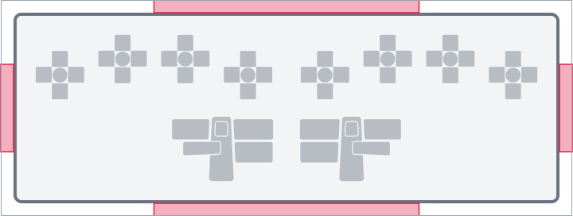{ width="520" loading=lazy }
</figure>

###### `inset` { #output-layout-spacing-inset }
| Type                            | Default                       | Base       |
| ------------------------------- | ----------------------------- | ---------- |
| `float` \| `string` \| `null`       | `null` (→ `2.5%` of doc width) | doc width  |

The **inner** padding inside the keyboard border. Used both as the gap
between the border line and the first content row, and as the inter-element
gap between stacked sections (clusters, legends, footer) inside the
document column.

<figure markdown="1">
<figcaption>The rose bands trace the gap between the document border and the content.</figcaption>
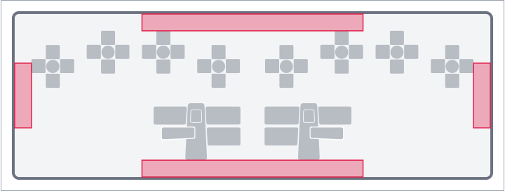{ width="520" loading=lazy }
</figure>

###### `column_gap` { #output-layout-spacing-column-gap }
| Type                            | Default                        | Base       |
| ------------------------------- | ------------------------------ | ---------- |
| `float` \| `string` \| `null`       | `null` (→ `2.5%` of doc width)  | doc width  |

Horizontal gap between side-by-side columns of content — between the
two halves of the keyboard, and between the macros and tap-dance
sections when both are rendered.

<figure markdown="1">
<figcaption>The three rose bands fall between the four finger clusters of one half-keyboard.</figcaption>
{ width="520" loading=lazy }
</figure>

##### Section and table rhythm

###### `section_spacing` { #output-layout-spacing-section-spacing }
| Type                            | Default                         | Base       |
| ------------------------------- | ------------------------------- | ---------- |
| `float` \| `string` \| `null`       | `null` (→ `1.5%` of doc width)   | doc width  |

Vertical gap between a section's title strip (the `MACROS` / `TAP-DANCE`
header rule) and the section body that follows it.

<figure markdown="1">
<figcaption>The rose band sits between the title rule and the column-header strip.</figcaption>
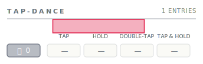{ width="360" loading=lazy }
</figure>

###### `section_title_rule_gap` { #output-layout-spacing-section-title-rule-gap }
| Type                            | Default                         | Base       |
| ------------------------------- | ------------------------------- | ---------- |
| `float` \| `string` \| `null`       | `null` (→ `0.56%` of doc width)  | doc width  |

Vertical breathing room between the title text and the rule line below
it inside a section title strip. The strip is top-anchored: the title
sits at the strip's top edge, the rule sits `section_title_rule_gap`
units below the title's bottom edge, and that defines the strip's
total height.

<figure markdown="1">
<figcaption>The rose band shows the gap between the section title bottom and the rule line.</figcaption>
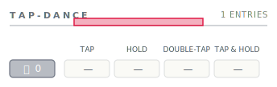{ width="380" loading=lazy }
</figure>

###### `table_header_spacing` { #output-layout-spacing-table-header-spacing }
| Type                            | Default                          | Base       |
| ------------------------------- | -------------------------------- | ---------- |
| `float` \| `string` \| `null`       | `null` (→ `0.75%` of doc width)   | doc width  |

The "header to content" gap inside any table-shaped composable. Used
in three places that all share the same rhythm:

* Tap-dance column header (`TAP / HOLD / DOUBLE-TAP / TAP & HOLD`) →
  the first row's variant cells.
* Tap-dance / macro chip → its body content (variant cells, pill row).
* Named-macro header strip (chip + name + rule) → the macro's pill
  row below it.

<figure markdown="1">
<figcaption>The rose band sits between the column-header text and the first data row.</figcaption>
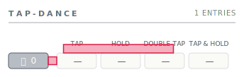{ width="460" loading=lazy }
</figure>

###### `table_col_spacing` { #output-layout-spacing-table-col-spacing }
| Type                            | Default                           | Base       |
| ------------------------------- | --------------------------------- | ---------- |
| `float` \| `string` \| `null`       | `null` (→ `0.375%` of doc width)   | doc width  |

Horizontal gap between adjacent columns inside a table — the four
tap-dance variant cells in a row, and the action pills inside a macro
pill row.

<figure markdown="1">
<figcaption>Three rose slivers between the four variant cells of one tap-dance row.</figcaption>
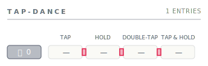{ width="460" loading=lazy }
</figure>

###### `table_row_spacing` { #output-layout-spacing-table-row-spacing }
| Type                            | Default                          | Base       |
| ------------------------------- | -------------------------------- | ---------- |
| `float` \| `string` \| `null`       | `null` (→ `0.56%` of doc width)   | doc width  |

Vertical gap between adjacent rows inside a table.

<figure markdown="1">
<figcaption>Two rose bands between three stacked tap-dance rows.</figcaption>
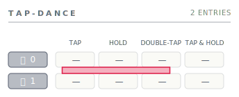{ width="500" loading=lazy }
</figure>

##### Cluster geometry

###### `finger_key_gap` { #output-layout-spacing-finger-key-gap }
| Type                            | Default                | Base                  |
| ------------------------------- | ---------------------- | --------------------- |
| `float` \| `string` \| `null`       | `null` (→ `1.8%`)      | finger cluster width  |

Gap between the **center** key and the four **outer** keys (N / E / S / W)
inside a finger cluster. This is the visible space that surrounds the
center key's cross. Scales to the cluster's width, not the doc width,
so the geometry stays proportional however the cluster gets sized.

<figure markdown="1">
<figcaption>Four rose bands frame the center key inside a finger cluster.</figcaption>
{ width="320" loading=lazy }
</figure>

###### `thumb_key_gap` { #output-layout-spacing-thumb-key-gap }
| Type                            | Default                | Base                 |
| ------------------------------- | ---------------------- | -------------------- |
| `float` \| `string` \| `null`       | `null` (→ `3.8%`)      | thumb cluster width  |

Vertical breathing room above each of the four outer thumb keys (pad,
nail, up, knuckle). Thumb clusters tessellate rather than gap — the
keys overlap by half this value at their seams — so a clean
inter-key rectangle doesn't exist; the highlighted bands sit
**directly above** each outer key. Scales to the thumb cluster's own
width.

<figure markdown="1">
<figcaption>Four rose bands sit on top of the pad, nail, up, and knuckle keys.</figcaption>
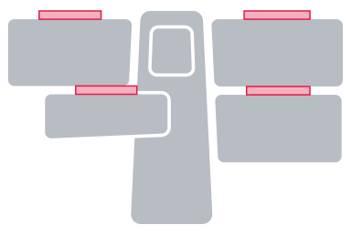{ width="420" loading=lazy }
</figure>

###### `layer_indicator_spacing` { #output-layout-spacing-layer-indicator-spacing }
| Type                            | Default                          | Base       |
| ------------------------------- | -------------------------------- | ---------- |
| `float` \| `string` \| `null`       | `null` (→ `0.75%` of doc width)   | doc width  |

Distance between an outer key's edge and its layer-indicator badge —
the small coloured circle showing the layer this key switches to.
Doc-width-relative on purpose: finger and thumb clusters share the
same gap, so indicators read at a uniform visual weight regardless of
cluster sizing.

<figure markdown="1">
<figcaption>The rose band sits between the north key's top edge and its layer indicator.</figcaption>
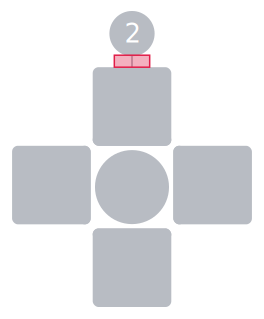{ width="320" loading=lazy }
</figure>

##### Chip / pill / badge internals

###### `chip_padding` { #output-layout-spacing-chip-padding }
| Type                            | Default                          | Base       |
| ------------------------------- | -------------------------------- | ---------- |
| `float` \| `string` \| `null`       | `null` (→ `1.25%` of doc width)   | doc width  |

Symmetric horizontal inset inside any chip-shaped element: the
named-macro / tap-dance chip outline. Acts as the leading and trailing
padding around the chip's name text. Vertical padding inside the chip
is **derived** as `chip_padding * 0.25`, so the chip's height adjusts
in step with horizontal changes.

<figure markdown="1">
<figcaption>The rose bands flank the name text inside a tap-dance chip outline.</figcaption>
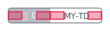{ width="320" loading=lazy }
</figure>

###### `tap_dance_pill_padding` { #output-layout-spacing-tap-dance-pill-padding }
| Type                            | Default                          | Base       |
| ------------------------------- | -------------------------------- | ---------- |
| `float` \| `string` \| `null`       | `null` (→ `1.25%` of doc width)   | doc width  |

Symmetric horizontal inset inside a tap-dance variant cell (the small
pill that carries one of `TAP` / `HOLD` / `DOUBLE-TAP` / `TAP & HOLD`).
Vertical padding is `tap_dance_pill_padding * 0.25`.

<figure markdown="1">
<figcaption>The rose bands flank the centred label inside a tap-dance variant cell.</figcaption>
{ width="460" loading=lazy }
</figure>

###### `macro_action_inset` { #output-layout-spacing-macro-action-inset }
| Type                            | Default                           | Base       |
| ------------------------------- | --------------------------------- | ---------- |
| `float` \| `string` \| `null`       | `null` (→ `0.625%` of doc width)   | doc width  |

Uniform inset for all three positions inside a macro action pill:

1. Pill edge → action icon centre.
2. Action icon → label text.
3. Label text → pill edge.

A single value drives all three so the pill's internal rhythm stays
consistent.

<figure markdown="1">
<figcaption>Three rose bands inside one macro action pill.</figcaption>
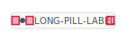{ width="320" loading=lazy }
</figure>

###### `layer_badge_inset` { #output-layout-spacing-layer-badge-inset }
| Type                            | Default                          | Base       |
| ------------------------------- | -------------------------------- | ---------- |
| `float` \| `string` \| `null`       | `null` (→ `0.94%` of doc width)   | doc width  |

Leading horizontal inset inside the overview's layer badge — the gap
between the badge edge and the start of the layer index. The trailing
inset (gap between the layer name and the badge's right edge) is
**derived** as `layer_badge_inset * 2`, weighted heavier so the right
edge reads as breathing room rather than crowding the next column.

<figure markdown="1">
<figcaption>Two rose bands flank the index column; the dashed band on the right shows the derived trailing inset (= 2× the leading value).</figcaption>
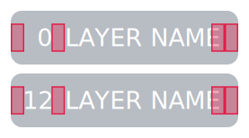{ width="380" loading=lazy }
</figure>

### `style` { #output-style }
The largest sub-section. Every visual switch, stroke width, and color
knob lives here. Configurable values are grouped by the conceptual
component they configure rather than dumped as flat siblings —
visibility flags live alongside the stroke widths and other styling
that affect the same element.

Current schema:

```yaml
output:
  style:
    # Standalone style switches
    hold_symbol_position: <"qmk" | "inward" | "outward">
    use_layer_colors_on_keys: <boolean>
    use_system_fonts: <boolean>
    show_transparent_fallthrough: <boolean>

    # Object-shaped configs
    border:
      ...                      # see output.style.border below
    layer_connector:
      ...                      # see output.style.layer_connector below
    layer_indicator:
      ...                      # see output.style.layer_indicator below
    legend_tables:
      ...                      # see output.style.legend_tables below
    strokes:
      ...                      # see output.style.strokes below
    palette:
      ...                      # see output.style.palette below
```

#### `hold_symbol_position` { #output-style-hold-symbol-position }
| Type     | Default     | Allowed values                |
| -------- | ----------- | ----------------------------- |
| `string` | `"outward"` | `"qmk"`, `"inward"`, `"outward"` |

For hold-tap keys (`LT`, `MT`, etc.) Skim splits the key visually into the
"hold" portion and the "tap" portion. This setting controls which side of
the split each portion goes on:

- **`"outward"`** — the **hold** side faces outward from the cluster's
  centre. Left-hand keys put hold on the left, right-hand keys put hold
  on the right. Reads naturally because the "modifier-ish" hold action
  ends up on the outer edge of the keyboard.
- **`"inward"`** — the mirror of the above. Hold faces the cluster
  centre; tap faces the outer edge.
- **`"qmk"`** — uses the argument order QMK macros define. Since QMK
  always lists hold first and tap second (e.g., `LT(layer, key)`), this
  mode draws hold on the left and tap on the right regardless of which
  side of the keyboard the key is on.

<figure markdown="1">
<figcaption>Three LEFT thumb clusters, each rendered with one of the three modes — same hold-tap labels in every panel; only the swap behaviour differs.</figcaption>
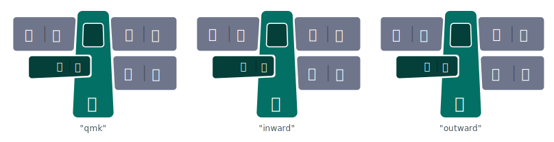{ width="640" loading=lazy }
</figure>

#### `use_layer_colors_on_keys` { #output-style-use-layer-colors-on-keys }
| Type      | Default |
| --------- | ------- |
| `boolean` | `true`  |

When `true`, layer-switching keys (the keys that activate or hold a layer)
get tinted using the activating layer's color from `palette.layers`. When
`false`, every key uses the standard neutral background regardless of the
layer it activates. Useful when you want a more uniform look or when you
prefer to encode layer membership only in the badge column of the
overview.

<figure markdown="1">
<figcaption>The cluster's north key activates layer 2. With <code>true</code>, layer 2's colour paints the key; with <code>false</code>, the key falls back to neutral.</figcaption>
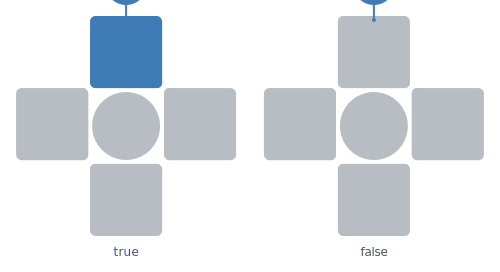{ width="500" loading=lazy }
</figure>

#### `use_system_fonts` { #output-style-use-system-fonts }
| Type      | Default |
| --------- | ------- |
| `boolean` | `false` |

When `false` (default), the SVG embeds the bundled fonts so the rendered
image looks identical on every machine. When `true`, the SVG references
system fonts by name — the file is smaller and may pick up your system's
preferred typefaces, but viewers without those fonts installed will see a
fallback.

#### `show_transparent_fallthrough` { #output-style-show-transparent-fallthrough }
| Type      | Default |
| --------- | ------- |
| `boolean` | `true`  |

When `true`, transparent keycodes (`KC_TRNS` / `_______`) on layers above
0 render the label from layer 0 in a faded "ghost" color, so you can see
what's underneath. Set to `false` to leave transparent keys completely
blank.

<figure markdown="1">
<figcaption>A transparent key on a layer above 0. With <code>true</code>, the layer-0 label paints in a lightness-shifted variant of the key's colour; with <code>false</code>, the key is blank.</figcaption>
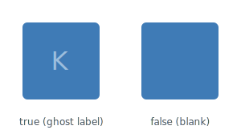{ width="320" loading=lazy }
</figure>

#### `border` { #output-style-border }
Configures the rounded rectangle border drawn around the entire keyboard.
Set the whole `border` object to `null` to suppress the border.

```yaml
output:
  style:
    border:
      width: <float | "N%">
      radius: <float>
```

##### `width` { #output-style-border-width }
| Type    | Default | Base       |
| ------- | ------- | ---------- |
| `float` \| `string` | `2` | doc width |

Stroke width of the border line. Accepts the same magnitude rule as
the spacings — a float `< 1` is a proportion of the doc width, a
float `≥ 1` is absolute SVG units, and a `"N%"` string is the
proportion shorthand.

<figure markdown="1">
<figcaption>The rose stroke replaces the document border at the configured width.</figcaption>
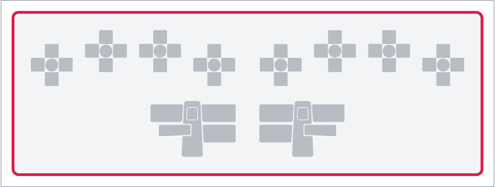{ width="520" loading=lazy }
</figure>

##### `radius` { #output-style-border-radius }
| Type    | Default |
| ------- | ------- |
| `float` | `10`    |

Corner radius for the rounded rectangle. Set to `0` for square corners.

#### `layer_connector` { #output-style-layer-connector }
Configures the dotted connector paths painted in the keymap overview
image — the lines linking each layer indicator circle to its
corresponding key on the miniature keymap.

```yaml
output:
  style:
    layer_connector:
      show: <boolean>
      width: <float | "N%" | null>
      dot_spacing: <float | "N%" | null>
```

The two stroke / spacing fields follow the magnitude rule (`< 1`
proportion / `≥ 1` absolute / `"N%"` shorthand / `null` default).

##### `show` { #output-style-layer-connector-show }
| Type      | Default |
| --------- | ------- |
| `boolean` | `true`  |

Whether to draw connector paths in the overview at all. Set to
`false` for a cleaner overview that lets the badge column and the
miniature keymap stand on their own. Has no effect on per-layer
images (which never paint connectors).

<figure markdown="1">
<figcaption>Two miniature 3-layer overviews built from the same keymap (two layer-switch keys on the LEFT half), stacked top to bottom. The dotted connectors only paint in the <code>true</code> panel.</figcaption>
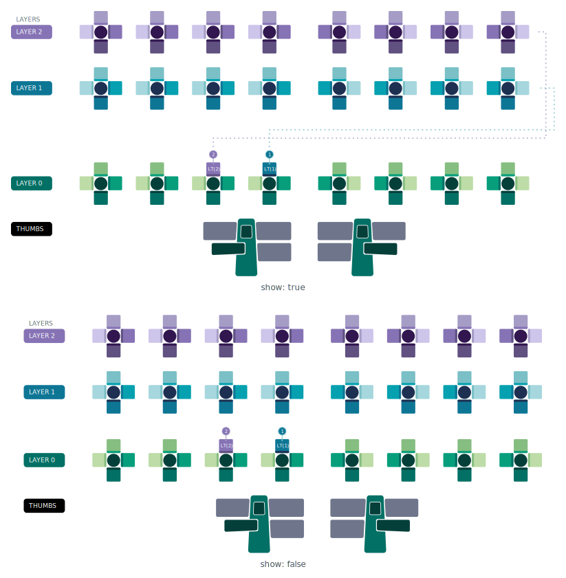{ width="540" loading=lazy }
</figure>

##### `width` { #output-style-layer-connector-width }
| Type                            | Default                          | Base       |
| ------------------------------- | -------------------------------- | ---------- |
| `float` \| `string` \| `null`       | `null` (→ `0.27%` of doc width)   | doc width  |

Stroke width of the connector path. The default value is tuned to
read clearly on the canonical 1600-unit overview image; bump it for
larger canvases or when you want the connectors to dominate the
overview's chrome more.

<figure markdown="1">
<figcaption>The rose dotted line illustrates a connector path painted at the configured width.</figcaption>
{ width="360" loading=lazy }
</figure>

##### `dot_spacing` { #output-style-layer-connector-dot-spacing }
| Type                            | Default                          | Base       |
| ------------------------------- | -------------------------------- | ---------- |
| `float` \| `string` \| `null`       | `null` (→ `0.77%` of doc width)   | doc width  |

Gap between adjacent dots along the connector path. Controls the
visible cadence of the dotted line — smaller values pack the dots
tighter; larger values space them out so the line reads as a sparser
trail.

<figure markdown="1">
<figcaption>The rose band sits in the gap between two adjacent dots.</figcaption>
{ width="360" loading=lazy }
</figure>

#### `layer_indicator` { #output-style-layer-indicator }
Configures the layer-indicator badges — the small coloured circles
drawn next to layer-switch keys in each cluster, and the matching
badges in the overview's `LAYERS` column.

```yaml
output:
  style:
    layer_indicator:
      show: <boolean>
      width: <float | "N%" | null>
```

The gap between an outer key's edge and its indicator circle lives
on [`output.layout.spacing.layer_indicator_spacing`](#output-layout-spacing-layer-indicator-spacing)
since it's a spacing value applied between two elements rather than
a property of the indicator itself.

##### `show` { #output-style-layer-indicator-show }
| Type      | Default |
| --------- | ------- |
| `boolean` | `true`  |

Whether to draw layer-indicator badges. Each circle is tinted with
the destination layer's colour, giving an at-a-glance hint of "where
does this key take me." Set to `false` to suppress them entirely
(both in clusters and in the overview's badge column).

<figure markdown="1">
<figcaption>The cluster's north key activates layer 2. With <code>true</code>, a layer-tinted indicator badge sits above the key; with <code>false</code>, the badge is suppressed.</figcaption>
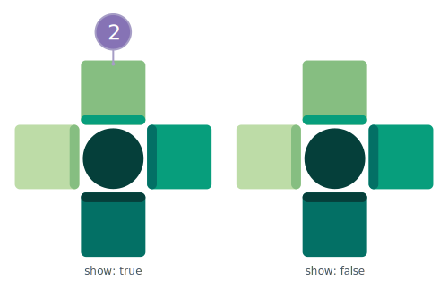{ width="500" loading=lazy }
</figure>

##### `width` { #output-style-layer-indicator-width }
| Type                            | Default                          | Base       |
| ------------------------------- | -------------------------------- | ---------- |
| `float` \| `string` \| `null`       | `null` (→ `0.125%` of doc width)  | doc width  |

Stroke width of the indicator circle outline.

<figure markdown="1">
<figcaption>The rose stroke traces the layer indicator circle on the north key.</figcaption>
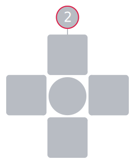{ width="320" loading=lazy }
</figure>

#### `legend_tables` { #output-style-legend-tables }
Configures the three legend tables Skim renders alongside the
keymap: macros, tap-dances, and symbols. Each sub-block carries its
own visibility flag and standalone-image body-scale multiplier; the
symbols sub-block also carries a flow direction and column count
unique to its multi-column layout.

```yaml
output:
  style:
    legend_tables:
      macros:
        show: <boolean>
        scale: <float>
      tap_dances:
        show: <boolean>
        scale: <float>
      symbols:
        show: <boolean>
        scale: <float>
        flow: <"row" | "column">
        columns: <integer | null>
```

The `show` flags toggle whether the corresponding legend appears
**embedded** in per-layer / overview images. The `scale` values
apply only to the **standalone** images (`skim generate -l macros` /
`-l tap-dances` / `-l symbols`); the chrome (title, footer, outer
padding) stays at the unscaled per-image size.

##### `show` { #output-style-legend-tables-macros-show }
| Type      | Default |
| --------- | ------- |
| `boolean` | `true`  |

Whether to embed the macros legend in per-layer images and the
overview. The legend lists every macro referenced on the layer (or
across all layers, in the overview), with its `name` and `preview`
from `keycodes.macros`. Set to `false` to omit it.

##### `scale` { #output-style-legend-tables-macros-scale }
| Type    | Default |
| ------- | ------- |
| `float` | `1.5`   |

Body-scale multiplier for the standalone macros image. Body chips
and pills scale by this factor; the per-image chrome stays unscaled.

##### `show` { #output-style-legend-tables-tap-dances-show }
| Type      | Default |
| --------- | ------- |
| `boolean` | `true`  |

Whether to embed the tap-dances legend in per-layer images and the
overview. Mirrors `macros.show`.

##### `scale` { #output-style-legend-tables-tap-dances-scale }
| Type    | Default |
| ------- | ------- |
| `float` | `1.5`   |

Body-scale multiplier for the standalone tap-dances image. Same
semantics as `macros.scale`.

##### `show` { #output-style-legend-tables-symbols-show }
| Type      | Default |
| --------- | ------- |
| `boolean` | `true`  |

Whether to embed the symbol legend in per-layer images and the
overview. Per-layer images carry only the symbols actually used on
that layer; the overview carries the union across all rendered
layers.

##### `scale` { #output-style-legend-tables-symbols-scale }
| Type    | Default |
| ------- | ------- |
| `float` | `1.5`   |

Body-scale multiplier for the standalone symbols image. Same
semantics as `macros.scale`.

##### `flow` { #output-style-legend-tables-symbols-flow }
| Type     | Default      | Allowed values        |
| -------- | ------------ | --------------------- |
| `string` | `"column"`   | `"row"`, `"column"`   |

Controls how multi-column symbol-legend layouts fill themselves:

- **`"column"`** — fills each column top-to-bottom before starting
  the next column. Reads top-to-bottom first.
- **`"row"`** — fills each row left-to-right before dropping to the
  next row. Reads left-to-right first.

<figure markdown="1">
<figcaption>Same six entries (three modifiers + three layer indices) laid out at two columns; the cell ordering reveals the difference between top-to-bottom and left-to-right fill.</figcaption>
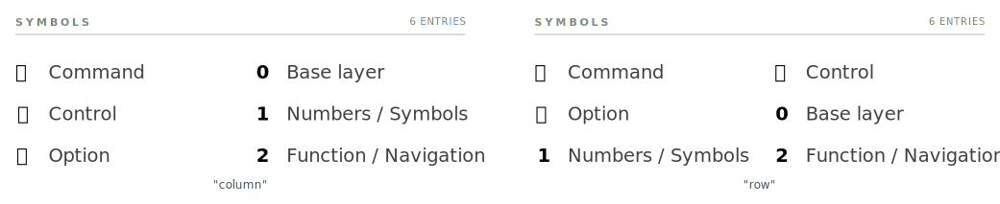{ width="800" loading=lazy }
</figure>

##### `columns` { #output-style-legend-tables-symbols-columns }
| Type            | Default |
| --------------- | ------- |
| `integer` \| `null` | `null`  |

Forces the **standalone** symbols image to lay out at exactly this
many columns and shrinks the canvas to fit. `null` (the default)
lets the layout pick the largest column count that fits the canvas
budget — the behaviour used in per-layer and overview images. Has
no effect on the embedded legends inside per-layer / overview
images, only on the standalone symbols-only output.

#### `strokes` { #output-style-strokes }
Stroke widths for chrome lines that don't have their own dedicated
block:

* The document border lives on
  [`output.style.border.width`](#output-style-border-width) (paired
  with `border.radius`).
* The layer connector path lives on
  [`output.style.layer_connector.width`](#output-style-layer-connector-width)
  (paired with `dot_spacing`).
* The layer indicator circle lives on
  [`output.style.layer_indicator.width`](#output-style-layer-indicator-width)
  (paired with `show`).

The two fields below follow the magnitude rule (`< 1` proportion /
`≥ 1` absolute / `"N%"` shorthand / `null` default).

```yaml
output:
  style:
    strokes:
      chip_outline: <float | "N%" | null>
      header_rule: <float | "N%" | null>
```

##### `chip_outline` { #output-style-strokes-chip-outline }
| Type                            | Default                           | Base       |
| ------------------------------- | --------------------------------- | ---------- |
| `float` \| `string` \| `null`       | `null` (→ `0.075%` of doc width)   | doc width  |

Stroke around macro and tap-dance chips — the rounded rectangle that
carries the chip's icon and id (and, for named entries, extends
across the name area on the right).

<figure markdown="1">
<figcaption>The rose stroke replaces the chip outline at the configured width.</figcaption>
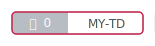{ width="320" loading=lazy }
</figure>

##### `header_rule` { #output-style-strokes-header-rule }
| Type                            | Default                           | Base       |
| ------------------------------- | --------------------------------- | ---------- |
| `float` \| `string` \| `null`       | `null` (→ `0.075%` of doc width)   | doc width  |

Stroke of every header rule — the line under each section title
strip (`MACROS`, `TAP-DANCE`, `SYMBOLS`) and the hairline below a
named-macro's chip-and-name header. A single value drives both so
the rule weights stay consistent across all sections.

<figure markdown="1">
<figcaption>The rose stroke replaces the rule line under the section title.</figcaption>
{ width="380" loading=lazy }
</figure>

#### `palette` { #output-style-palette }
Color tokens used throughout the rendered image.

Current schema:

```yaml
output:
  style:
    palette:
      neutral_color: <string>
      text_color: <string>
      key_label_color: <string>
      background_color: <string>
      border_color: <string>
      macro_color: <string>
      tap_dance_color: <string>
      layers:
        ...                    # see output.style.palette.layers below
```

A worked example:

```yaml
output:
  style:
    palette:
      background_color: "#FFFFFF"
      text_color: "#1F2933"
      key_label_color: "#FFFFFF"
      neutral_color: "#6F768B"
      border_color: "#000000"
      macro_color: "#89511C"
      tap_dance_color: "#41687F"
      layers:
        - base_color: "#3366CC"
        - base_color: "#CC6633"
```

##### Chrome colors

These apply to the document chrome (background, headings, borders) and to
keys that don't get a layer-specific tint.

| Field              | Default     | What it tints |
| ------------------ | ----------- | ------------- |
| `background_color` | `"white"`   | The image background. |
| `text_color`       | `"black"`   | Body text outside of keys (titles, legends, footer). |
| `key_label_color`  | `"white"`   | Text on key faces (chosen for contrast against typically dark key backgrounds). |
| `neutral_color`    | `"#6F768B"` | Keys without a layer-specific color (most thumb cluster keys, transparent fall-throughs). |
| `border_color`     | `"black"`   | Keyboard outer border and cluster outlines. |
| `macro_color`      | `"#89511C"` | Macro badges on keys and the title bar of the macros legend. |
| `tap_dance_color`  | `"#41687F"` | Tap-dance badges on keys and the title bar of the tap-dances legend. |

All accept any CSS color string (`"red"`, `"#3366CC"`, `"rgb(51,102,204)"`,
`"hsl(218 60% 50%)"`).

##### `layers` { #output-style-palette-layers }
| Type | Default |
| ---- | ------- |
| list of `LayerColor` | `[]` |

Per-layer color configurations. The list aligns by **position** with
`keyboard.layers`: the *N*-th palette entry colors the *N*-th keyboard
layer. If `palette.layers` is shorter than `keyboard.layers`, the extra
layers get auto-generated colors — so you can leave the list empty for
a quick start and fill it in later.

Current schema:

```yaml
output:
  style:
    palette:
      layers:
        - base_color: <string>
          color_index: <integer>
          gradient:
            - <string>
            - ...
        - ...
```

Each entry has these fields:

##### Auto-generated layer colors

When a layer has no explicit `palette.layers` entry, Skim derives a
base color from its `index` field. Sixteen visually-distinct colors
are produced from **8 hues × 2 lightness levels**, walked in
bit-reversed order so consecutive indices always land on
maximally-distant hues. Layers 16–31 fill in the gaps with eight
*intermediate* hues at the same two lightness levels:

| `index`  | Hue band                              | Lightness |
| -------- | ------------------------------------- | --------- |
| `0`–`7`  | 8 base hues, 45° apart (starting on green) | bright    |
| `8`–`15` | the same 8 base hues                  | dim       |
| `16`–`23` | 8 intermediate hues (22.5° offset)    | bright    |
| `24`–`31` | the same 8 intermediate hues          | dim       |

Why 45° between hues instead of 22.5°? Sixteen evenly-spaced hues sit
22.5° apart — narrow enough that several adjacent ones (especially in
the green region) blur together. Eight hues at 45° apart read as
decisively different colors, and the bright/dim alternation gives a
second axis of distinction so layers `0` and `8` (both green) still
look like separate layers.

The hue sequence for layers `0`–`7` lands on green, magenta, blue,
orange, yellow-green, red, purple, and yellow — eight slots that read
clearly as different colors. Layers `8`–`15` repeat the same hue walk
at the dim lightness; layers `16`–`23` and `24`–`31` do the same with
the intermediate hue set.

Saturation is capped at `0.65` so auto-generated colors share
the muted profile of the curated sample palettes shipped with Skim.

###### `base_color`

| Type     | Default |
| -------- | ------- |
| `string` | —       |

The primary CSS color for the layer. In single-color mode (no `gradient`),
every key on the layer uses this color. In gradient mode, this is the
"anchor" color used to derive the gradient automatically when one isn't
provided explicitly.

###### `color_index`

| Type      | Default |
| --------- | ------- |
| `integer` | `2`     |

Which gradient stop (`0`–`5`) is the "primary" color for this layer.
Cluster keys use this index to pick their fill, and adjacent positions
get progressively darker/lighter shades of the gradient. Only meaningful
when `gradient` is set or auto-generated.

###### `gradient`

| Type | Default |
| ---- | ------- |
| 6-tuple of CSS color strings, or `null` | `null` |

Six colors that map to the six positions in a finger cluster (centre,
north, east, south, west, double-south). When `null`, Skim derives a
gradient automatically from `base_color` and `color_index` — six tints
ranging from very dark to very light, with `base_color` placed at
`color_index`.

```yaml
output:
  style:
    palette:
      layers:
        # Layer 0: single red, no gradient — every key the same shade.
        - base_color: "#FF0000"

        # Layer 1: explicit 6-stop gradient for cluster depth.
        - base_color: "#CC6633"
          color_index: 2
          gradient:
            - "#CC6633"
            - "#AA5522"
            - "#884411"
            - "#663300"
            - "#442200"
            - "#221100"
```
