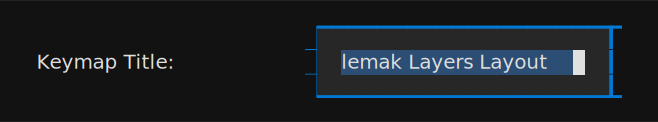
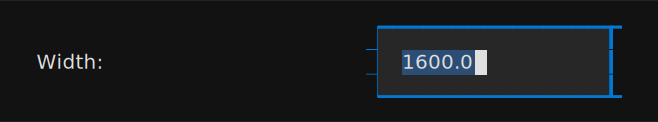
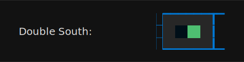
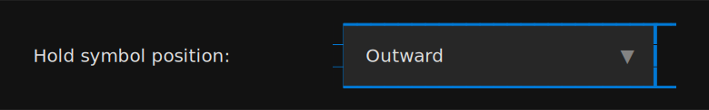
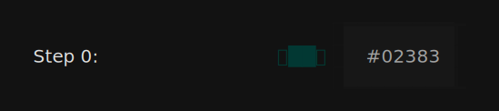
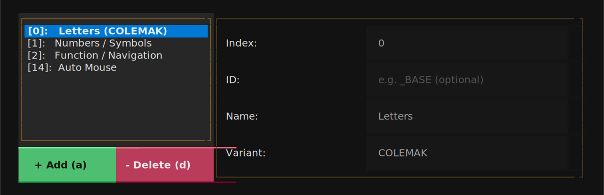

# Configurator UI

The Configurator UI is a terminal app for editing a Skim configuration
without writing YAML by hand. Every field in the UI maps to an entry in
[`config-file.md`](config-file.md); the Configurator only adds an
interactive front end for the same schema.

Launch it with `skim configure -i`. To open an existing config, pass
`-c <path>`; to seed the editor from a keymap file, pass `-k <path>`. See
[`skim configure`](cli-options.md#configure) for the full set of launch flags.

The UI requires the optional `textual` extra. Install it with
`pip install qmk-skim[tui]` if `skim doctor` reports the dependency
missing.

> [!NOTE]
> **How to read this reference.** Headings in `` `code style` `` name a
> literal field in the underlying configuration — the heading
> `` ### `Keymap Title` `` documents the input that writes to
> [`output.keymap_title`](config-file.md#output-keymap-title). Plain-text
> headings ("Tabs", "Status bar", "Field components") name a piece of the
> UI itself, not a configurable field. Every field section starts with a
> short type / config-target table and a one-line description, then links
> to the config-file reference for the full visual semantics — this page
> does not repeat what the rendered output looks like.

## Anatomy { #anatomy }

{ width="993" loading=lazy }

The Configurator window has three fixed pieces: a **tab bar** at the top,
a **scrolling content area** in the middle, and a **status bar** at the
bottom. The content area changes per tab; the tab bar and status bar
persist.

### Tabs { #anatomy-tabs }

{ width="1033" loading=lazy }

The tab bar lists the three top-level configuration groups.

| Tab        | Schema target                                          | What you edit                                                   |
| ---------- | ------------------------------------------------------ | --------------------------------------------------------------- |
| Keyboard   | [`keyboard`](config-file.md#keyboard) + a few `output` knobs | Hardware features, layer roster, image title, copyright.   |
| Keycodes   | [`keycodes`](config-file.md#keycodes)                  | Pre-process rules, label overrides, macro and tap-dance metadata. |
| Output     | [`output`](config-file.md#output)                      | Layout, colours, borders, legends, palette.                     |

The active tab is highlighted in the tab bar. Switch tabs by clicking
the tab title or by pressing `Ctrl+P` (previous) / `Ctrl+N` (next). The
last-focused field on a tab is restored when you return to it, so
moving between tabs doesn't lose your place.

### Scrolling content area { #anatomy-content }

{ width="1015" loading=lazy }

The middle of the window is a vertical scroller that holds every section
of the active tab stacked top-to-bottom. Sections start with a coloured
**section title** (the accent colour) and contain one or more field rows.

When the active tab is taller than the terminal window, the scroller
keeps the focused row visible — moving focus past the bottom of the
viewport scrolls the content automatically. You can also scroll
explicitly with `Ctrl+E` (down) and `Ctrl+Y` (up); the wheel and
`PageUp` / `PageDown` work too. A scrollbar on the right of the
scrolling area indicates how much of the tab is currently visible.

### Status bar { #anatomy-status-bar }

{ width="1033" loading=lazy }

The status bar at the bottom of the window lists the key bindings that
apply right now. The bindings are global — they work from any tab and
regardless of which field is focused. The set is:

| Binding   | Action          |
| --------- | --------------- |
| `Ctrl+Q`  | Quit (prompts to save unsaved changes). |
| `Ctrl+S`  | Save the current state to disk.         |
| `Ctrl+P`  | Switch to the previous tab.             |
| `Ctrl+N`  | Switch to the next tab.                 |
| `Ctrl+E`  | Scroll the content area down.           |
| `Ctrl+Y`  | Scroll the content area up.             |
| `F1` / `Alt+H` | Open the help overlay.             |

Modal dialogs (save target, overwrite confirm, quit confirm, help) carry
their own bindings — those replace the main set while the dialog is
open, then disappear when the dialog closes.

### Field components { #anatomy-components }

Every editable row uses one of a small set of components, plus a
left-aligned label that names the field. The label width is fixed (22
cells) so labels and fields line up across rows in the same section.

#### Text input { #anatomy-components-text-input }

{ width="494" loading=lazy }

A single-line text editor. Each keystroke updates the underlying
config field immediately — there is no per-field commit step. Empty
input maps to `null` for fields whose schema accepts `null`.

Pressing `Escape` does **not** roll back changes in a plain text
input; the rollback affordance only exists inside a
[list/detail pane](#anatomy-components-list-detail), where the pane's
edit lifecycle wraps every field it contains.

#### Numeric input { #anatomy-components-numeric-input }

{ width="494" loading=lazy }

Visually identical to the text input. Numeric fields are plain text
boxes with no input filtering — you can type any character. The
underlying handler tries to parse the value as a number on each
keystroke; if parsing fails, the previous numeric value is kept and
the input keeps its current text without visible feedback. Watch the
rendered output (or the matching field in the YAML preview) to
confirm the value took.

#### Switch { #anatomy-components-switch }

{ width="356" loading=lazy }

A two-state toggle. Click the switch or press `Space` / `Enter` while
focused to flip it. The change commits immediately; there is no
edit / cancel cycle.

#### Select { #anatomy-components-select }

{ width="585" loading=lazy }

A drop-down. `Enter` or `Space` opens the list; arrow keys move the
highlight; `Enter` commits the highlighted entry; `Escape` closes the
list without changing the field.

#### Colour input { #anatomy-components-colour-input }

{ width="603" loading=lazy }

A text input paired with a live colour swatch in the same row. The
input accepts any CSS colour value the schema allows (named colours,
`#RRGGBB`, `rgb()` / `hsl()` strings); the swatch updates as you type.
An autocomplete list suggests CSS colour names while you're typing.

#### List/detail pane { #anatomy-components-list-detail }

{ width="905" loading=lazy }

A two-column widget: a scrolling list of entries on the left, a
form for the selected entry on the right. The list side is fixed at
about a third of the row width; the detail side fills the rest.

The list/detail pane has its own edit lifecycle — entries are
read-only until you press `Enter` (or click into a detail field),
which puts the row into edit mode. From edit mode:

- `Enter` commits the changes and returns to read-only.
- `Escape` discards the changes and returns to read-only.
- Clicking outside the detail area auto-commits.

Two buttons at the top of the list manage the list itself:

- `+ Add (a)` — append a new entry with default values and immediately
  enter edit mode. Pressing `a` while the list is focused does the same.
- `- Delete (d)` — remove the selected entry. Pressing `d` while the
  list is focused does the same. Removal is immediate; use `Ctrl+Q` to
  exit without saving if you remove the wrong row.

To reorder entries, focus the list and press `m`. The selected row gets
a `↕` move indicator; use the arrow keys to slide it up or down and
`Enter` to commit the new position (or `Escape` to cancel).
