# Configurator UI

The Configurator UI is a terminal app for editing a Skim configuration
without writing YAML by hand. Every field in the UI maps to an entry in
[`config-file.md`](config-file.md); the Configurator only adds an
interactive front end for the same schema.

Launch it with `skim configure -i`. To open an existing config, pass
`-c <path>`; to seed the editor from a keymap file, pass `-k <path>`. See
[`skim configure`](cli-options.md#configure) for the full set of launch flags.

The UI requires the optional `textual` extra. Install it with
`pip install qmk-skim[tui]` if `skim doctor` reports the dependency
missing.

> [!NOTE]
> **How to read this reference.** The page is in two halves. The
> [Anatomy](#anatomy) section names the Configurator's UI scaffolding —
> tabs, the scrolling content area, the status bar, and the field
> components used to edit values. The per-tab sections that follow
> (Keyboard, Keycodes, Output) walk every editable field, organised
> Tab → Section → Field. Every field block opens with a screenshot,
> includes the same help text the in-app `F1` overlay shows, and ends
> with a **Configures:** line linking to the matching entry in
> [`config-file.md`](config-file.md) — that's where you'll find the
> visual semantics, defaults, and accepted values.

## Anatomy { #anatomy }

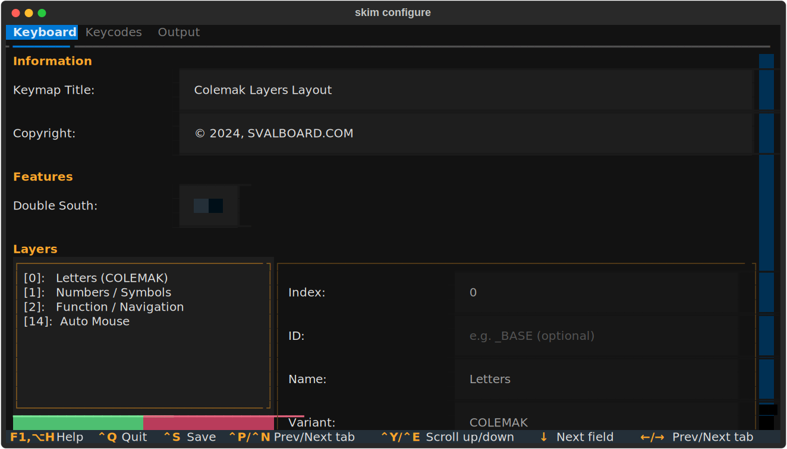{ width="993" loading=lazy }

The Configurator window has three fixed pieces: a **tab bar** at the top,
a **scrolling content area** in the middle, and a **status bar** at the
bottom. The content area changes per tab; the tab bar and status bar
persist.

### Tabs { #anatomy-tabs }

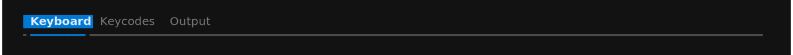{ width="1033" loading=lazy }

The tab bar lists the three top-level configuration groups.

| Tab        | Schema target                                          | What you edit                                                   |
| ---------- | ------------------------------------------------------ | --------------------------------------------------------------- |
| Keyboard   | [`keyboard`](config-file.md#keyboard) + a few `output` knobs | Hardware features, layer roster, image title, copyright.   |
| Keycodes   | [`keycodes`](config-file.md#keycodes)                  | Pre-process rules, label overrides, macro and tap-dance metadata. |
| Output     | [`output`](config-file.md#output)                      | Layout, colors, borders, legends, palette.                     |

The active tab is highlighted in the tab bar. Switch tabs by clicking
the tab title or by pressing `Ctrl+P` (previous) / `Ctrl+N` (next). The
last-focused field on a tab is restored when you return to it, so
moving between tabs doesn't lose your place.

### Scrolling content area { #anatomy-content }

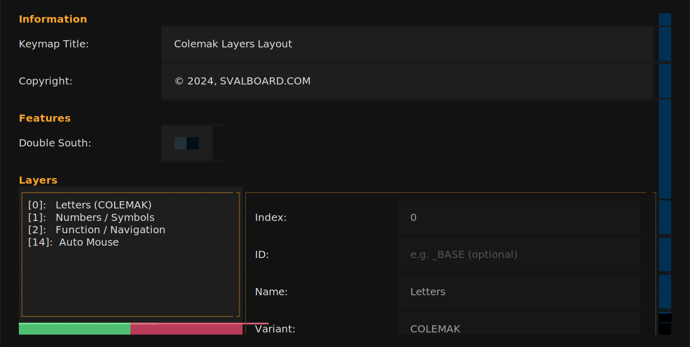{ width="1015" loading=lazy }

The middle of the window is a vertical scroller that holds every section
of the active tab stacked top-to-bottom. Sections start with a colored
**section title** (the accent color) and contain one or more field rows.

When the active tab is taller than the terminal window, the scroller
keeps the focused row visible — moving focus past the bottom of the
viewport scrolls the content automatically. You can also scroll
explicitly with `Ctrl+E` (down) and `Ctrl+Y` (up); the wheel and
`PageUp` / `PageDown` work too. A scrollbar on the right of the
scrolling area indicates how much of the tab is currently visible.

### Status bar { #anatomy-status-bar }

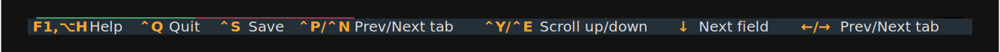{ width="1033" loading=lazy }

The status bar at the bottom of the window lists the key bindings that
apply right now. The bindings are global — they work from any tab and
regardless of which field is focused. The set is:

| Binding   | Action          |
| --------- | --------------- |
| `Ctrl+Q`  | Quit (prompts to save unsaved changes). |
| `Ctrl+S`  | Save the current state to disk.         |
| `Ctrl+P`  | Switch to the previous tab.             |
| `Ctrl+N`  | Switch to the next tab.                 |
| `Ctrl+E`  | Scroll the content area down.           |
| `Ctrl+Y`  | Scroll the content area up.             |
| `F1` / `Alt+H` | Open the help overlay.             |

Modal dialogs (save target, overwrite confirm, quit confirm, help) carry
their own bindings — those replace the main set while the dialog is
open, then disappear when the dialog closes.

### Field components { #anatomy-components }

Every editable row uses one of a small set of components, plus a
left-aligned label that names the field. The label width is fixed (22
cells) so labels and fields line up across rows in the same section.

#### Text input { #anatomy-components-text-input }

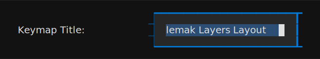{ width="494" loading=lazy }

A single-line text editor. Each keystroke updates the underlying
config field immediately — there is no per-field commit step. Empty
input maps to `null` for fields whose schema accepts `null`.

Pressing `Escape` does **not** roll back changes in a plain text
input; the rollback affordance only exists inside a
[list/detail pane](#anatomy-components-list-detail), where the pane's
edit lifecycle wraps every field it contains.

##### Interaction { #anatomy-components-text-input-interaction }

| Binding     | Action                       |
| ----------- | ---------------------------- |
| `Tab`       | Move focus to the next field |
| `Shift+Tab` | Move focus to the previous field |

When inside a list/detail pane the input also responds to `Enter` (commit
changes, exit edit mode) and `Escape` (discard changes, exit edit mode).

#### Numeric input { #anatomy-components-numeric-input }

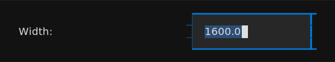{ width="494" loading=lazy }

Visually identical to the text input. Numeric fields are plain text
boxes with no input filtering — you can type any character. The
underlying handler tries to parse the value as a number on each
keystroke; if parsing fails, the previous numeric value is kept and
the input keeps its current text without visible feedback. Watch the
rendered output (or the matching field in the YAML preview) to
confirm the value took.

##### Interaction { #anatomy-components-numeric-input-interaction }

Identical to the
[text input's interaction](#anatomy-components-text-input-interaction).

#### Switch { #anatomy-components-switch }

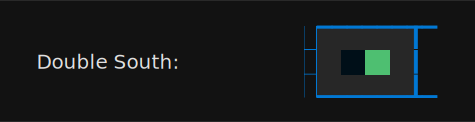{ width="356" loading=lazy }

A two-state toggle. Click the switch or press `Space` / `Enter` while
focused to flip it. The change commits immediately; there is no
edit / cancel cycle.

##### Interaction { #anatomy-components-switch-interaction }

| Binding         | Action                       |
| --------------- | ---------------------------- |
| `Enter` / `Space` | Toggle the switch          |

#### Select { #anatomy-components-select }

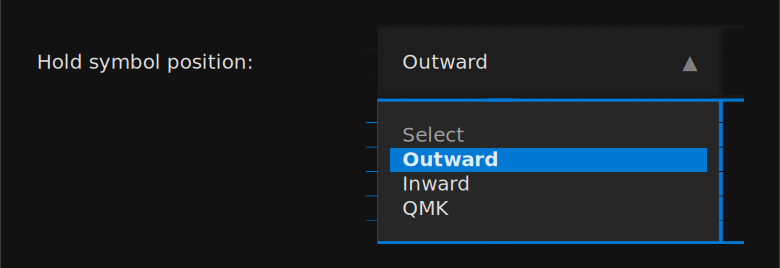{ width="585" loading=lazy }

A drop-down. `Enter` or `Space` opens the list; arrow keys move the
highlight; `Enter` commits the highlighted entry; `Escape` closes the
list without changing the field.

##### Interaction { #anatomy-components-select-interaction }

| Binding             | When closed              | When open                         |
| ------------------- | ------------------------ | --------------------------------- |
| `Enter` / `Space`   | Open the dropdown        | Commit the highlighted option     |
| `Escape`            | Discard pending changes¹ | Close the dropdown without changing the value |
| `Tab` / `Shift+Tab` | Move focus to next / previous field | —                       |
| `↑` / `↓`           | —                        | Move the highlight in the dropdown |

¹ Discard only applies inside a list/detail pane that's in edit mode;
otherwise `Escape` is a no-op.

#### Color input { #anatomy-components-color-input }

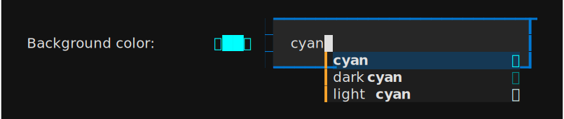{ width="604" loading=lazy }

A text input paired with a live color swatch in the same row. The
input accepts any CSS color value the schema allows (named colors,
`#RRGGBB`, `rgb()` / `hsl()` strings); the swatch updates as you type.
An autocomplete list suggests CSS color names while you're typing.

##### Interaction { #anatomy-components-color-input-interaction }

| Binding     | Action                                   |
| ----------- | ---------------------------------------- |
| `Tab`       | Move focus to the next field             |
| `Shift+Tab` | Move focus to the previous field         |
| `Alt+↑`     | Increase saturation by `0.05` (HSL nudge) |
| `Alt+↓`     | Decrease saturation by `0.05` (HSL nudge) |
| `Alt+→`     | Increase lightness by `0.05` (HSL nudge)  |
| `Alt+←`     | Decrease lightness by `0.05` (HSL nudge)  |

The `Alt+arrow` HSL nudges only fire when the input currently holds a
six-digit hex color (`#RRGGBB`); named colors, three-digit hex, and
`rgb()` / `hsl()` strings are silently skipped. Inside a list/detail
pane, the input also responds to `Enter` / `Escape` for commit /
discard.

#### List/detail pane { #anatomy-components-list-detail }

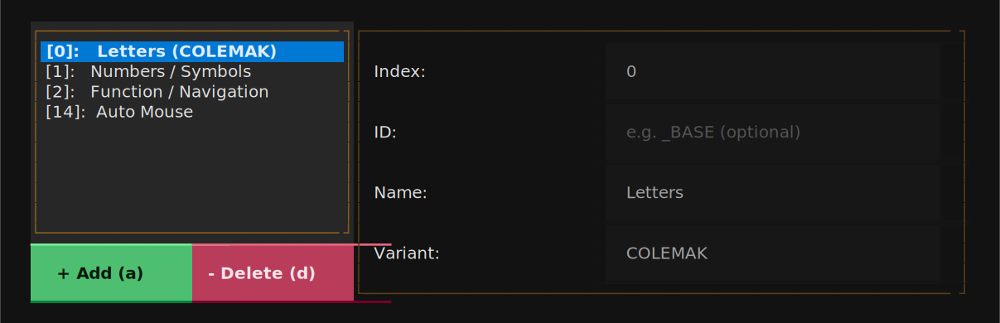{ width="905" loading=lazy }

A two-column widget: a scrolling list of entries on the left, a
form for the selected entry on the right. The list side is fixed at
about a third of the row width; the detail side fills the rest.

The list/detail pane has its own edit lifecycle — entries are
read-only until you press `Enter` (or click into a detail field),
which puts the row into edit mode. From edit mode:

- `Enter` commits the changes and returns to read-only.
- `Escape` discards the changes and returns to read-only.
- Clicking outside the detail area auto-commits.

Two buttons at the top of the list manage the list itself:

- `+ Add (a)` — append a new entry with default values and immediately
  enter edit mode. Pressing `a` while the list is focused does the same.
- `- Delete (d)` — remove the selected entry. Pressing `d` while the
  list is focused does the same. Removal is immediate; use `Ctrl+Q` to
  exit without saving if you remove the wrong row.

To reorder entries, focus the list and press `m`. The selected row gets
a `↕` move indicator; use the arrow keys to slide it up or down and
`Enter` to commit the new position (or `Escape` to cancel).

##### Interaction { #anatomy-components-list-detail-interaction }

When the list is focused:

| Binding   | Default behaviour              | In move mode                |
| --------- | ------------------------------ | --------------------------- |
| `↑` / `↓` | Move the cursor between entries | Move the selected entry up / down |
| `Enter`   | Edit the selected entry        | Confirm the new position    |
| `Escape`  | —                              | Cancel the move (rollback)  |
| `m`       | Enter move mode                | —                           |
| `a`       | Add a new entry (same as the `+ Add` button) | —             |
| `d`       | Delete the selected entry (same as the `- Delete` button) | — |

Once the pane is in edit mode, focus moves to the detail-side inputs
which carry their own per-component bindings (Text input, Select,
Switch, Color input).

## Keyboard tab { #fields-keyboard }

Hardware metadata, image titling, and the layer roster.

### Info { #fields-keyboard-info }

#### Keymap Title { #keyboard-info-title }

{ width="494" loading=lazy }



**Configures:** [`output.keymap_title`](config-file.md#output-keymap-title)

---

#### Copyright { #keyboard-info-copyright }

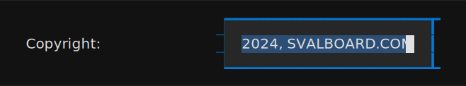{ width="494" loading=lazy }



**Configures:** [`output.copyright`](config-file.md#output-copyright)

---

### Features { #fields-keyboard-features }

#### Double South { #keyboard-feature-double-south }

{ width="357" loading=lazy }



**Configures:** [`keyboard.features.double_south`](config-file.md#keyboard-features-double-south)

---

### Layers { #fields-keyboard-layers }

#### Layers { #keyboard-layer-list }

{ width="906" loading=lazy }



**Configures:** [`keyboard.layers`](config-file.md#keyboard-layers)

---

#### Layer Index { #keyboard-layer-index }

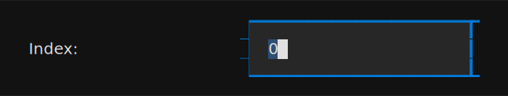{ width="485" loading=lazy }



**Configures:** [`keyboard.layers[*].index`](config-file.md#keyboard-layers)

---

#### Layer ID { #keyboard-layer-id }

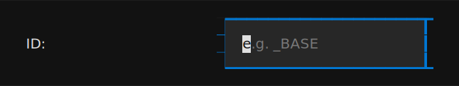{ width="485" loading=lazy }



**Configures:** [`keyboard.layers[*].id`](config-file.md#keyboard-layers)

---

#### Layer Name { #keyboard-layer-name }

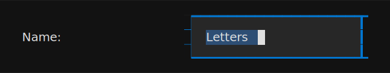{ width="485" loading=lazy }



**Configures:** [`keyboard.layers[*].name`](config-file.md#keyboard-layers)

---

#### Layer Variant { #keyboard-layer-variant }

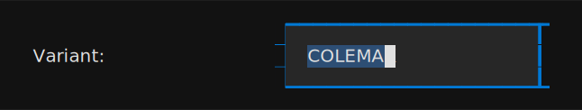{ width="485" loading=lazy }



**Configures:** [`keyboard.layers[*].variant`](config-file.md#keyboard-layers)

---

## Keycodes tab { #fields-keycodes }

Keycode rewriting, label overrides, and metadata for macros and tap-dances.

### Pre-process { #fields-keycodes-pre-process }

#### Pre-process Keycodes { #keycodes-pre-proc-list }

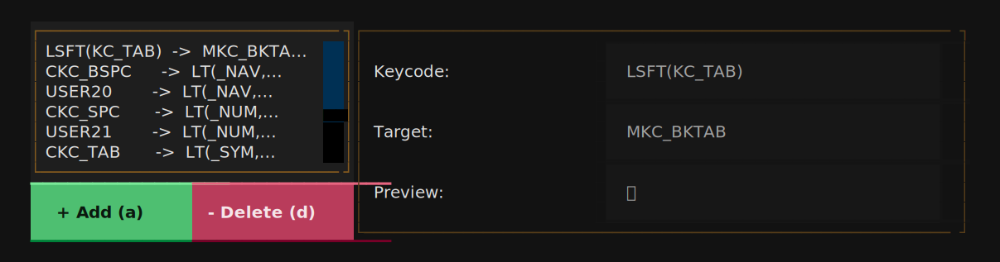{ width="906" loading=lazy }



**Configures:** [`keycodes.pre_process`](config-file.md#keycodes-pre-process)

---

#### Pre-process — Keycode { #keycodes-pre-proc-keycode }

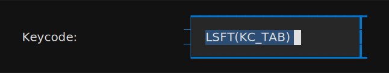{ width="485" loading=lazy }



**Configures:** [`keycodes.pre_process[*].keycode`](config-file.md#keycodes-pre-process)

---

#### Pre-process — Target { #keycodes-pre-proc-target }

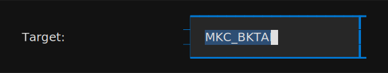{ width="485" loading=lazy }



**Configures:** [`keycodes.pre_process[*].target`](config-file.md#keycodes-pre-process)

---

### Overrides { #fields-keycodes-overrides }

#### Keycode Overrides { #keycodes-override-list }

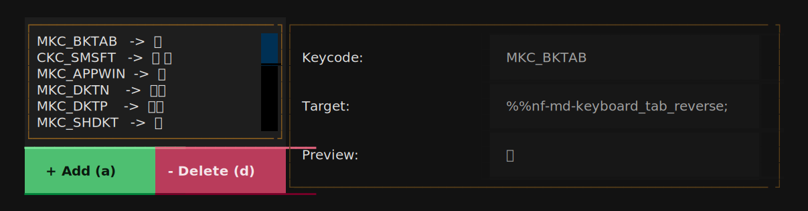{ width="906" loading=lazy }



**Configures:** [`keycodes.overrides`](config-file.md#keycodes-overrides)

---

#### Override — Keycode { #keycodes-override-keycode }

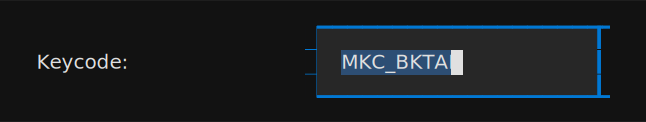{ width="485" loading=lazy }



**Configures:** [`keycodes.overrides[*].keycode`](config-file.md#keycodes-overrides)

---

#### Override — Target { #keycodes-override-target }

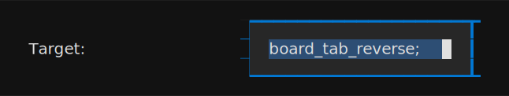{ width="485" loading=lazy }



**Configures:** [`keycodes.overrides[*].target`](config-file.md#keycodes-overrides)

---

### Macros { #fields-keycodes-macros }

#### Macros { #keycodes-macro-list }

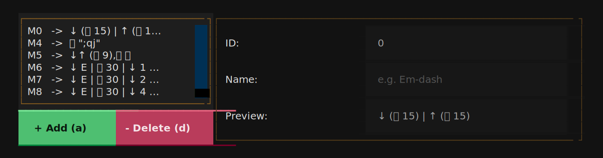{ width="906" loading=lazy }



**Configures:** [`keycodes.macros`](config-file.md#keycodes-macros)

---

#### Macro — ID { #keycodes-macro-id }

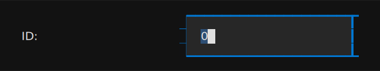{ width="485" loading=lazy }



**Configures:** [`keycodes.macros[*].id`](config-file.md#keycodes-macros)

---

#### Macro — Name { #keycodes-macro-name }

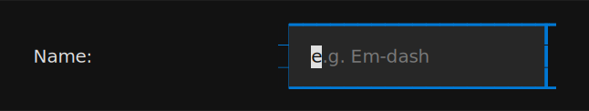{ width="485" loading=lazy }



**Configures:** [`keycodes.macros[*].name`](config-file.md#keycodes-macros)

---

### Tap-dances { #fields-keycodes-tap-dances }

#### Tap Dances { #keycodes-tap-dance-list }

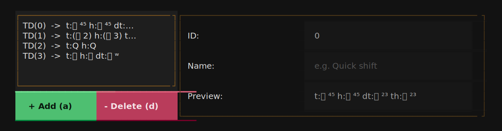{ width="906" loading=lazy }



**Configures:** [`keycodes.tap_dances`](config-file.md#keycodes-tap-dances)

---

#### Tap Dance — ID { #keycodes-tap-dance-id }

{ width="485" loading=lazy }



**Configures:** [`keycodes.tap_dances[*].id`](config-file.md#keycodes-tap-dances)

---

#### Tap Dance — Name { #keycodes-tap-dance-name }

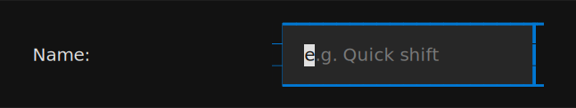{ width="485" loading=lazy }



**Configures:** [`keycodes.tap_dances[*].name`](config-file.md#keycodes-tap-dances)

---

## Output tab { #fields-output }

Layout dimensions, colors, and styling for the rendered images.

### Page { #fields-output-page }

#### Layout Width { #output-page-width }

{ width="494" loading=lazy }



**Configures:** [`output.layout.width`](config-file.md#output-layout-width)

---

#### Layout Margin { #output-page-margin }

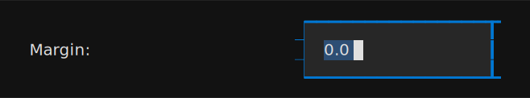{ width="494" loading=lazy }



**Configures:** [`output.layout.spacing.margin`](config-file.md#output-layout-spacing-margin)

---

#### Layout Inset { #output-page-inset }

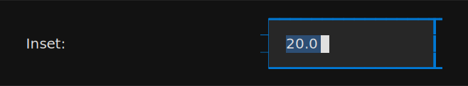{ width="494" loading=lazy }



**Configures:** [`output.layout.spacing.inset`](config-file.md#output-layout-spacing-inset)

---

#### Border Enabled { #output-page-border-enabled }

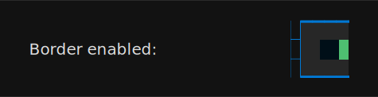{ width="357" loading=lazy }



**Configures:** [`output.style.border`](config-file.md#output-style-border)

---

#### Border Width { #output-page-border-width }

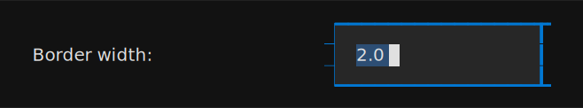{ width="494" loading=lazy }



**Configures:** [`output.style.border.width`](config-file.md#output-style-border-width)

---

#### Border Radius { #output-page-border-radius }

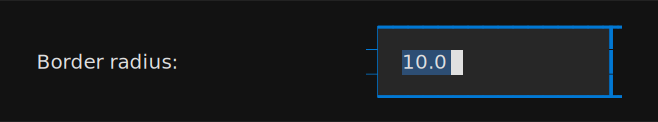{ width="494" loading=lazy }



**Configures:** [`output.style.border.radius`](config-file.md#output-style-border-radius)

---

### Style { #fields-output-style }

#### Hold Symbol Position { #output-style-hold-symbol-position }

{ width="586" loading=lazy }



**Configures:** [`output.style.hold_symbol_position`](config-file.md#output-style-hold-symbol-position)

---

#### Use System Fonts { #output-style-use-system-fonts }

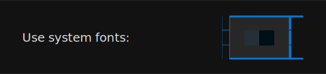{ width="403" loading=lazy }



**Configures:** [`output.style.use_system_fonts`](config-file.md#output-style-use-system-fonts)

---

#### Use Layer Colors on Keys { #output-style-use-layer-colors }

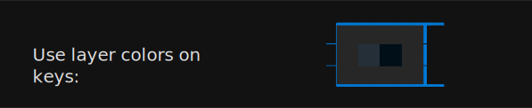{ width="448" loading=lazy }



**Configures:** [`output.style.use_layer_colors_on_keys`](config-file.md#output-style-use-layer-colors-on-keys)

---

#### Show Layer Indicators { #output-style-show-layer-indicators }

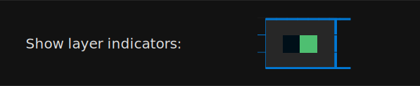{ width="448" loading=lazy }



**Configures:** [`output.style.layer_indicator.show`](config-file.md#output-style-layer-indicator-show)

---

#### Show Layer Connectors { #output-style-show-layer-connectors }

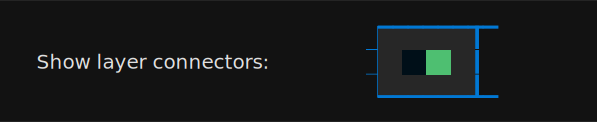{ width="448" loading=lazy }



**Configures:** [`output.style.layer_connector.show`](config-file.md#output-style-layer-connector-show)

---

#### Show Transparent Fall-through { #output-style-show-transparent-fallthrough }

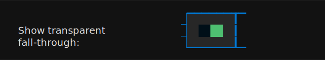{ width="494" loading=lazy }



**Configures:** [`output.style.show_transparent_fallthrough`](config-file.md#output-style-show-transparent-fallthrough)

---

#### Show special keys legend { #output-style-show-special-keys-legend }

{ width="494" loading=lazy }



**Configures:** [`output.style.legend_tables.macros.show`](config-file.md#output-style-legend-tables-macros-show) and [`output.style.legend_tables.tap_dances.show`](config-file.md#output-style-legend-tables-tap-dances-show)

---

#### Show symbol legend { #output-style-show-symbol-legend }

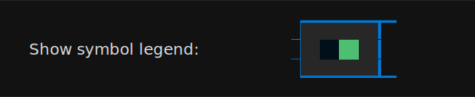{ width="448" loading=lazy }



**Configures:** [`output.style.legend_tables.symbols.show`](config-file.md#output-style-legend-tables-symbols-show)

---

#### Symbol legend flow { #output-style-symbol-legend-flow }

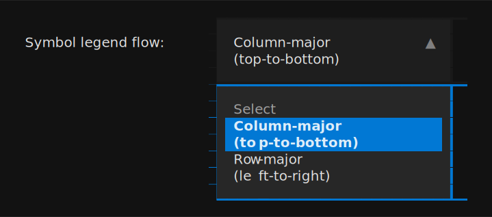{ width="540" loading=lazy }



**Configures:** [`output.style.legend_tables.symbols.flow`](config-file.md#output-style-legend-tables-symbols-flow)

---

### Palette { #fields-output-palette }

The chrome colors that frame every rendered image. Each takes any CSS color value the schema allows; see the chrome colors table on the [`output.style.palette`](config-file.md#output-style-palette) field for the full list of defaults and visual swatches.

#### Background Color { #output-palette-background-color }

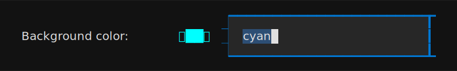{ width="586" loading=lazy }



**Configures:** [`output.style.palette.background_color`](config-file.md#output-style-palette)

---

#### Text Color { #output-palette-text-color }

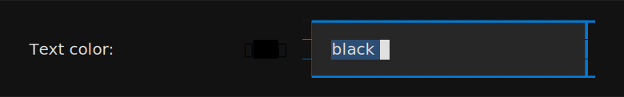{ width="586" loading=lazy }



**Configures:** [`output.style.palette.text_color`](config-file.md#output-style-palette)

---

#### Border Color { #output-palette-border-color }

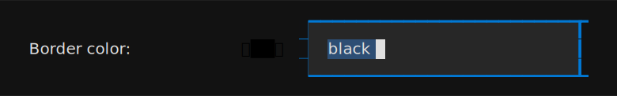{ width="586" loading=lazy }



**Configures:** [`output.style.palette.border_color`](config-file.md#output-style-palette)

---

#### Neutral Color { #output-palette-neutral-color }

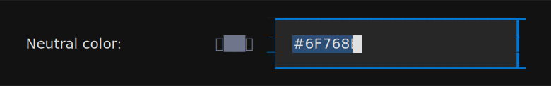{ width="586" loading=lazy }



**Configures:** [`output.style.palette.neutral_color`](config-file.md#output-style-palette)

---

#### Key Label Color { #output-palette-key-label-color }

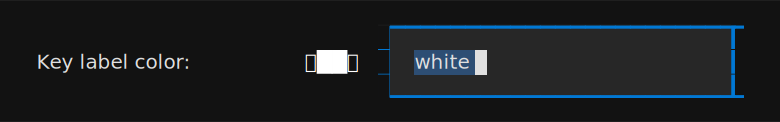{ width="586" loading=lazy }



**Configures:** [`output.style.palette.key_label_color`](config-file.md#output-style-palette)

---

#### Macro Color { #output-palette-macro-color }

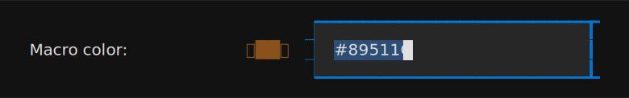{ width="586" loading=lazy }



**Configures:** [`output.style.palette.macro_color`](config-file.md#output-style-palette)

---

#### Tap-Dance Color { #output-palette-tap-dance-color }

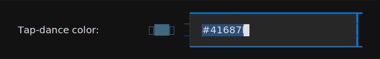{ width="586" loading=lazy }



**Configures:** [`output.style.palette.tap_dance_color`](config-file.md#output-style-palette)

---

### Layer Colors { #fields-output-layer-colors }

#### Layer Colors { #output-layer-color-list }

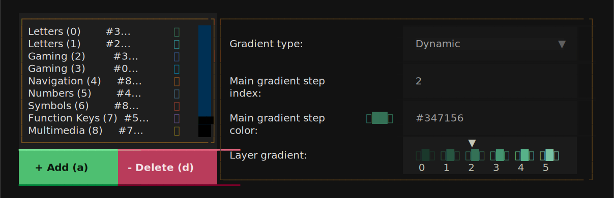{ width="906" loading=lazy }



**Configures:** [`output.style.palette.layers`](config-file.md#output-style-palette-layers)

---

#### Gradient Type { #output-layer-color-gradient-type }

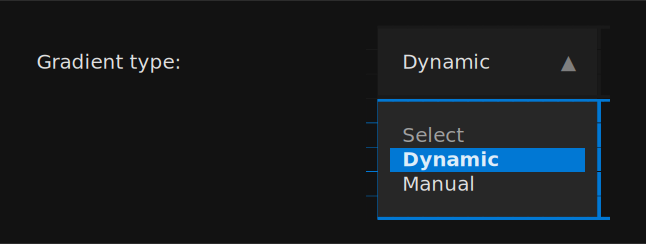{ width="485" loading=lazy }



**Configures:** [`output.style.palette.layers[*].gradient`](config-file.md#output-style-palette-layers)

---

#### Main Gradient Step Index { #output-layer-color-color-index }

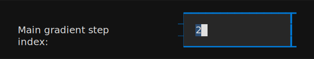{ width="485" loading=lazy }



**Configures:** [`output.style.palette.layers[*].color_index`](config-file.md#output-style-palette-layers)

---

#### Main Gradient Step Color { #output-layer-color-base-color }

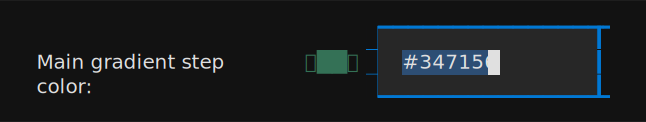{ width="485" loading=lazy }



**Configures:** [`output.style.palette.layers[*].base_color`](config-file.md#output-style-palette-layers)

---

#### Manual Gradient Step Color { #output-layer-color-step }

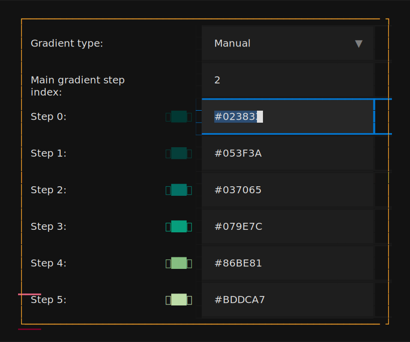{ width="613" loading=lazy }



**Configures:** entries of [`output.style.palette.layers[*].gradient`](config-file.md#output-style-palette-layers) (one per manual gradient step; the configurator surfaces all six positions side-by-side as `Step 0` … `Step 5`)

---
