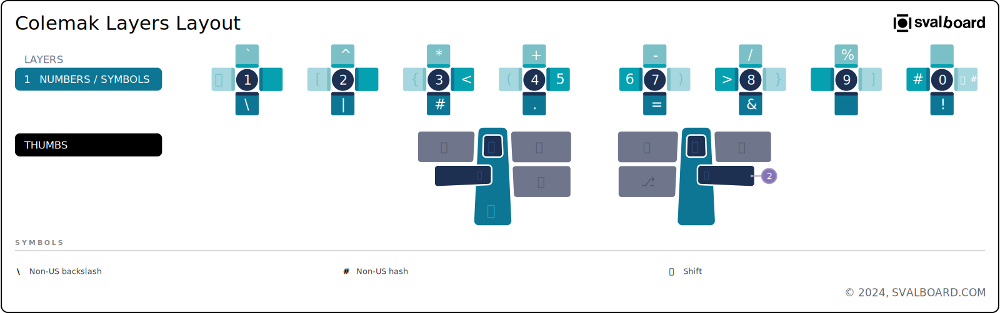

# Svalboard Keymap Image Maker (skim)

**skim** is a command-line tool for generating visual keyboard layout images
from QMK, Vial, and Keybard keymap configuration files.

---

{ width="100%" }

---

## User Guide

- [Introduction](introduction.md)
- [Getting Started](getting-started.md)
- [Configuration](configuration/index.md)

## Developer Reference

- [API Reference](api/index.md)
- [Changelog](changelog.md)

