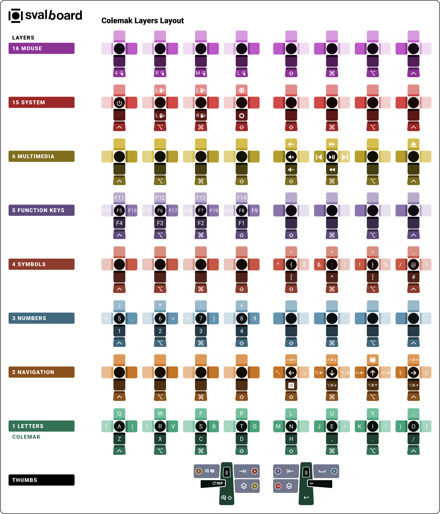

Svalboard Keymap Image Maker (skim)
====================================

**skim** is a command-line tool for generating visual keyboard layout images
from QMK, Vial, and Keybard keymap configuration files.

.. image:: https://img.shields.io/badge/python-3.10+-blue.svg
   :target: https://www.python.org/downloads/
   :alt: Python Version

.. image:: https://img.shields.io/badge/license-MIT-green.svg
   :target: https://github.com/Townk/skim/blob/mainline/LICENSE
   :alt: License

----

----

.. toctree::
   :maxdepth: 2
   :caption: User Guide

   introduction
   getting-started
   configuration

.. toctree::
   :maxdepth: 2
   :caption: Developer Reference

   api/index
   changelog

Indices and tables
==================

* :ref:`genindex`
* :ref:`modindex`
* :ref:`search`
